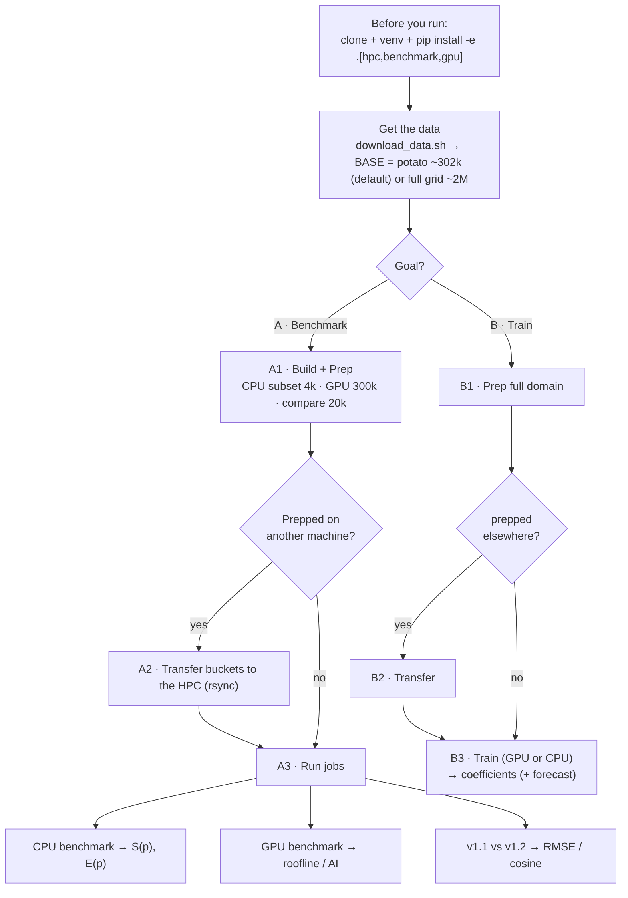

# HPC_code — run TDEW on SLURM / GPU

This folder runs the TDEW pipeline on a cluster (SLURM, CPU multi-node) or a GPU, plus the
benchmark harness for the scaling study in `tdew_estimation_pram.qmd`. Local single-machine
execution lives in [`../Local/`](../Local/); the shared algorithm lives in the `tdew_estimation`
package and is used unchanged by both.

It's **one pipeline**: _before you run_ → _get the data_ → pick a goal and follow it end-to-end —
**[A] Benchmark** (does it scale? which PISCOt version predicts dewpoint better?) or
**[B] Train the model** (coefficients you can apply). Each goal is: **build + prep → (transfer if
you prepped elsewhere) → run jobs**.

## Workflow at a glance



## What's here

| File | Purpose |
|------|---------|
| `hpc.py` | Cluster builders: `make_slurm_cluster` (dask-jobqueue), `make_local_cuda_cluster` (dask-cuda), `make_local_cpu_cluster` (baseline / `P=1`). Each returns a live `Client`. |
| `sbatch/download_data.sh` | Download the 3 figshare PISCOt products (`.nc`) and extract per variable. `--peru-potato` (default) or full grid. Resume-safe. |
| `nc_to_point_parquet.py` | The `.nc` → per-point monthly parquet extractor (Python/xarray port of the R/`terra` step). |
| `make_subset.py` | Filter the data to the first N IDs → a drop-in `--base` subset (CPU benchmark + quick tests). |
| `prep_inputs.py` / `sbatch/prep_inputs.sbatch` | **Prep**: build the reusable bucketed inputs (climatology, bucket-year dataset, shards) — *no training*. `--n-workers` parallelises it. |
| `run_training_hpc.py` | Train entrypoint: build `local\|slurm\|cuda` cluster → train coefficients (+ optional forecast). |
| `sbatch/train_cpu.sbatch` | CPU driver job — `MODE=train` (one run) or `MODE=benchmark` (scaling sweep). |
| `sbatch/train_gpu_a100.sbatch` | Single-GPU driver job (one A100 / MIG slice; `client=None`, no dask-cuda) — `MODE=train\|benchmark`. |
| `sbatch/bench_cpu_family.sbatch` | CPU scaling **family** in one job: strong sweep at several N + weak → one CSV for `analyze_scaling.py --by-size`. |
| `benchmark_scaling.py` | Scaling driver: fresh cluster per `(p, trial)` → time the runners → append timing rows to a CSV. |
| `benchmark_gpu_kernel.py` / `benchmark_gpu_pipeline.py` | Single-GPU kernel + full-pipeline **roofline** (GFLOPS, arithmetic intensity). |
| `analyze_scaling.py` / `analyze_gpu.py` | CSVs → markdown tables + PNG plots (speedup/efficiency [`--by-size` = family]; roofline / CPU-vs-GPU). |
| `evaluate_accuracy.py` / `compare_datasets.py` | Score forecast skill vs observed `TD` and compare two PISCOt versions (RMSE/MAE/bias/Pearson r/cosine). |
| `requirements-gpu.txt` · `_synth.py` · `tests/` | Optional GPU deps · synthetic data generator · pytest smoke tests (`pytest HPC_code`). |

---

# Before you run (once)

```bash
git clone https://github.com/CENTRO-INTERNACIONAL-DE-LA-PAPA/tdew_estimation.git
cd tdew_estimation && git checkout develop

# Python >=3.11 (on KHIPU: `module load python/3.11` first)
python3 -m venv .venv && source .venv/bin/activate && pip install -U pip
pip install -e ".[hpc,benchmark]"     # core + SLURM + plots — the CPU jobs
pip install -e ".[gpu]"               # + cupy-cuda12x — the GPU jobs (CUDA 12.x)
mkdir -p logs                         # REQUIRED: SLURM opens logs/*.out before the job body runs
```
Core deps are light & CPU-only; GPU/extraction/multi-GPU live in extras (`.[gpu]` / `.[netcdf]` /
`.[multigpu]`) so a plain install works anywhere. For the SLURM jobs, either activate this venv in
the `# source .../.venv/bin/activate` line of each `sbatch`, or pass `PYTHON=.../.venv/bin/python`.

# Get the data

The **potato-zones vs full-grid** choice is made *here* (the `--peru-potato` flag) and baked into
`BASE`; everything downstream just reads `BASE`.

```bash
export BASE=/media/ppalacios/Data/henry_simcast_peru          # potato planting zones (~302k) — default
# full PISCO grid instead (~2M points, ~6.6× the work) — extract ONCE into a SEPARATE base:
# PERU_POTATO=0 BASE=/media/ppalacios/Data/pisco_full bash HPC_code/sbatch/download_data.sh
# export BASE=/media/ppalacios/Data/pisco_full
```

**Where results go:** point `RUN` at a persistent dir on the machine that *runs the jobs*
(local: `RUN=$BASE`; KHIPU has no `$SCRATCH`, use e.g. `RUN=/home/$USER/tdew_run`). Never `/tmp`.

Now pick a goal: **[A] Benchmark** (below) or **[B] Train the model**.

---

# A · Benchmark pipeline

CPU on an **ID subset** (the scaling ratio is size-independent, and `p=1` on 300k ≈ 80 h),
GPU on the **full 300k** (~15–25 min), and the **v1.1-vs-v1.2** comparison on **20k** (statistically
ample; the forecast that scoring needs is CPU-bound, so a subset keeps it inside 8 h).

## A1 · Build + prep the three benchmark datasets

```bash
# --- CPU benchmark: 4000-ID subset, v1.2, B=256 (largest N must have B >= 4*p_max=128) ---
python HPC_code/make_subset.py --base "$BASE" --out "$BASE/sub4k" --n-ids 4000 \
    --vars td,tmin_v12 --year-range 1981,2016
python HPC_code/prep_inputs.py --base "$BASE/sub4k" --results "$BASE/res_cpu_v12" \
    --tmin-var tmin_v12 --train-start 1981 --train-end 2016 --no-future --num-buckets 256 --n-workers 24

# --- GPU benchmark + production model: full 300k, v1.2, B=1024 ---
python HPC_code/prep_inputs.py --base "$BASE" --results "$BASE/res_v12_300k" --tmin-var tmin_v12 \
    --train-start 1981 --train-end 2016 --pred-start 2017 --pred-end 2018 --num-buckets 1024 --n-workers 24

# --- Comparison: 20k IDs, BOTH versions, held-out split (train<=2014, forecast 2015), B=512 ---
python HPC_code/make_subset.py --base "$BASE" --out "$BASE/cmp20k" --n-ids 20000 \
    --vars td,tmin_v11,tmin_v12 --year-range 1981,2015
for V in v11 v12; do python HPC_code/prep_inputs.py --base "$BASE/cmp20k" --results "$BASE/cmp_$V" \
    --tmin-var tmin_$V --train-start 1981 --train-end 2014 --pred-start 2015 --pred-end 2015 \
    --num-buckets 512 --n-workers 24 ; done
```

## A2 · Transfer to the HPC — *only if you prepped on another machine*

If you prep locally and run on KHIPU, ship the bucketed inputs (skip this if you prep on the HPC):
```bash
KH=user@khipu.utec.edu.pe ; RUN=/home/$USER/tdew_run     # set RUN to your HPC path
ssh "$KH" "mkdir -p $RUN"
for d in res_cpu_v12 res_v12_300k cmp_v11 cmp_v12 cmp20k; do
  rsync -a --info=progress2 "$BASE/$d" "$KH:$RUN/"       # resumable; re-run if it drops
done
```
Otherwise set `RUN=$BASE` and continue.

## A3 · Run the jobs (`mkdir -p logs` first; each job ≤ 8 h on KHIPU)

**CPU benchmark — does it scale?** `T(p)`, speedup `S(p)=T(1)/T(p)`, efficiency `E(p)=S(p)/p`.
Strong = fix the problem, add workers; weak = grow the problem with the workers. (Family = one
curve per problem size N.)
```bash
RESULTS=$RUN/res_cpu_v12 N_LIST=64,128,256 P_LIST=1,2,4,8,16,32 \
    sbatch HPC_code/sbatch/bench_cpu_family.sbatch
python HPC_code/analyze_scaling.py --by-size --csv $RUN/res_cpu_v12/scaling_cpu_v12.csv \
    --out-dir $RUN/res_cpu_v12/cpu_family_plots --md-out $RUN/res_cpu_v12/cpu_family_tables.md
```

**GPU benchmark — how fast is the GPU?** Per-stage (assemble/convolve/solve) GFLOPS + arithmetic
intensity on a **roofline** (low AI → memory-bandwidth bound), throughput vs M, and CPU-vs-GPU.
The second command also trains the 300k model (= the GPU end-to-end point).
```bash
MODE=benchmark RESULTS=$RUN/res_v12_300k sbatch HPC_code/sbatch/train_gpu_a100.sbatch
MODE=train FORECAST=1 RESULTS=$RUN/res_v12_300k sbatch HPC_code/sbatch/train_gpu_a100.sbatch
python HPC_code/analyze_gpu.py --kernel-csv $RUN/res_v12_300k/gpu_kernel.csv \
    --pipeline-csv $RUN/res_v12_300k/gpu_pipeline.csv --scaling-csv $RUN/res_v12_300k/scaling_gpu.csv \
    --peak-fp64-gflops 4200 --out-dir $RUN/res_v12_300k/gpu_plots --md-out $RUN/res_v12_300k/gpu_report.md
```

**Comparison — which version predicts TDEW better?** Train both, forecast the withheld window,
score predicted vs **observed** `TD`: RMSE/MAE/bias/Pearson r/**cosine**. Lower RMSE wins.
```bash
for V in v11 v12; do MODE=train FORECAST=1 RESULTS=$RUN/cmp_$V \
    sbatch HPC_code/sbatch/train_gpu_a100.sbatch ; done
python HPC_code/evaluate_accuracy.py --pred-a $RUN/cmp_v11/predictions --pred-b $RUN/cmp_v12/predictions \
    --obs $RUN/cmp20k/td/Outputs --label-a v1.1 --label-b v1.2 \
    --out-dir $RUN/cmp/plots --md-out $RUN/cmp/accuracy_v11_v12.md
python HPC_code/compare_datasets.py \
    --coeffs-a $RUN/cmp_v11/llr_coeffs_anomaly_dataset --coeffs-b $RUN/cmp_v12/llr_coeffs_anomaly_dataset \
    --pred-a $RUN/cmp_v11/predictions --pred-b $RUN/cmp_v12/predictions \
    --label-a v1.1 --label-b v1.2 --out-dir $RUN/cmp/plots --md-out $RUN/cmp/compare_v11_v12.md
```

**Results** land under `$RUN/…`: `res_cpu_v12/cpu_family_{plots,tables}`,
`res_v12_300k/{gpu_plots,gpu_report.md}`, `cmp/{accuracy,compare}_v11_v12.md` + `cmp/plots`.

---

# B · Train pipeline (the production model)

Use this when you want the model itself: **coefficients per `(ID, doy)`** (`const_anom,
TMIN_anom_coeff, TD_anom_lag1, TD_anom_lag2, TMIN_anom_lag1, r_squared_anom`) — apply them to a new
`TMIN` series to estimate dewpoint. Trains on the **whole** dataset.

## B1 · Prep (full domain)
```bash
python HPC_code/prep_inputs.py --base "$BASE" --results "$BASE/model_v12" --tmin-var tmin_v12 \
    --train-start 1981 --train-end 2016 --pred-start 2017 --pred-end 2020 --num-buckets 1024 --n-workers 24
```
*(If the GPU-benchmark prep `res_v12_300k` already exists, reuse it — it's the same thing.)*

## B2 · Transfer (only if you prepped on another machine) — same `rsync` as A2.

## B3 · Train → coefficients (+ optional forecast)
```bash
# GPU (fast; ~15-25 min for 300k):
MODE=train FORECAST=1 RESULTS=$RUN/model_v12 sbatch HPC_code/sbatch/train_gpu_a100.sbatch
# or CPU multi-node (P=32):
# P=32 FORECAST=1 RESULTS=$RUN/model_v12 sbatch HPC_code/sbatch/train_cpu.sbatch
```
**Outputs** under `$RUN/model_v12/`: `llr_coeffs_anomaly_dataset/id_bucket=XXXX/coeffs.parquet`
(the model) and, with `FORECAST=1`, `predictions/` (+ `td_predictions.parquet`). Swap `tmin_v12`→
`tmin_v11` / `model_v11` for v1.1.

---

# Reference (knobs & internals)

## Changing SLURM parameters

Each `sbatch/*.sbatch` file begins with `#SBATCH` directives that request the *driver* job's
resources. Change them **two ways**: edit the line in the file (permanent for your site), or
**override at submit time** — a command-line flag beats the file:

```bash
sbatch -p mypartition -A myaccount -c 16 --mem=32G -t 02:00:00 \
       HPC_code/sbatch/train_cpu.sbatch          # overrides the #SBATCH lines for this run
```

| `#SBATCH` directive | What it requests | KHIPU default | Override flag |
|---|---|---|---|
| `--partition` | the queue | `standard` (CPU) / `gpu` (GPU) | `-p <queue>` |
| `--account` | billing account | `postgrado` | `-A <account>` |
| `--cpus-per-task` | cores on the driver node | `32` | `-c <n>` |
| `--mem` | RAM for the job | `64G` (CPU) / `32G` (GPU) | `--mem=<n>G` |
| `--gres` | GPUs | `gpu:a100_3g.20gb:1` (GPU job) | `--gres=<spec>` |
| `--time` | walltime cap | `04:00:00` (KHIPU max `08:00:00`) | `-t <hh:mm:ss>` |
| `--nodelist` | pin to a node | `ag001` (GPU) | `-w <node>` (or delete the line) |

**Driver vs worker fleet.** The `#SBATCH` lines size the **driver** (the one process that runs the
scheduler + Python). With `--cluster slurm` the actual **worker fleet** is requested *separately* by
dask-jobqueue and sized by the `--slurm-cores / --slurm-memory / --slurm-walltime` flags inside the
sbatch body (currently `16` cores / `64GB` / `02:00:00` per worker job) — edit those to change the
fleet, not the `#SBATCH` block. With `--cluster local` there is no fleet: workers are processes on
the driver node, bounded by `--cpus-per-task`.

**Try it locally first.** On a single machine / local SLURM, add `CLUSTER=local` to the CPU jobs
(runs on one node instead of spawning a dask-jobqueue fleet) and submit with `sbatch -p debug`. A
local SLURM usually has **no GPU GRES**, so run the GPU benchmark/train *directly* with
`python HPC_code/...` (or `benchmark_gpu_*` + `run_training_hpc.py --gpu-train`). To rehearse the
whole flow cheaply, point `BASE` at a `make_subset.py` subset.

**Cluster backends** (`--cluster`): `local` = single-node `LocalCluster` sized to `p`; `slurm` =
multi-node `dask-jobqueue` fleet of `p` workers (needs `--slurm-queue`/`--slurm-account`); `cuda` =
`dask-cuda` (future multi-GPU; not used on KHIPU's single GPU).

**sbatch environment variables** (override on the command line):

| Var | Used by | Meaning |
|---|---|---|
| `MODE` | train_cpu / train_gpu | `train` (default) or `benchmark` |
| `CLUSTER` | train_cpu / bench_cpu_family | `slurm` (default) or `local` (single node / testing) |
| `P` | train_cpu (train) | worker processes for a training run |
| `P_LIST`, `TRIALS` | benchmark | processor counts to sweep; repeats per point |
| `N_LIST` | bench_cpu_family | problem sizes (= `--num-buckets` values) for the family |
| `BENCH_MODE`, `N0` | train_cpu benchmark | `strong` (default) or `weak`; weak base buckets/proc |
| `NUM_BUCKETS` | benchmark | how many prepped buckets to use (≤ the B you prepped; `≥ 4·max(p)`) |
| `FORECAST` | train | `1` to also run the forecast phase |
| `DATASET_LABEL` | benchmark | tag written into the CSV (`v11`/`v12`) |
| `N_WORKERS`, `TMIN_VAR` | prep_inputs | parallel years; which TMIN version to prep |
| `SYNTH` | benchmark | build a synthetic dataset first (no real data needed) |

`run_training_hpc.py` does *one* run at a fixed `P`; `benchmark_scaling.py` *sweeps* `P` and writes
the scaling CSV — they share `train_cpu.sbatch` via `MODE`. The sbatch files are **preset for KHIPU**
(`account=postgrado`; CPU `standard`; GPU `gpu`/`ag001`/`gpu:a100_3g.20gb:1`; `cpu=32`, `08:00:00`);
override per site (`sbatch -p <part> -A <acct>`).

**Tests:** `pytest HPC_code` (CuPy/RAPIDS-free; GPU tests `importorskip`).

> **Caveats.** Confirm the MIG slice's FP64/HBM ceilings on the real GPU node. The "v1.1 vs v1.2"
> finding is **SME-validate-before-publish**, and any generative-AI assistance should be disclosed.
