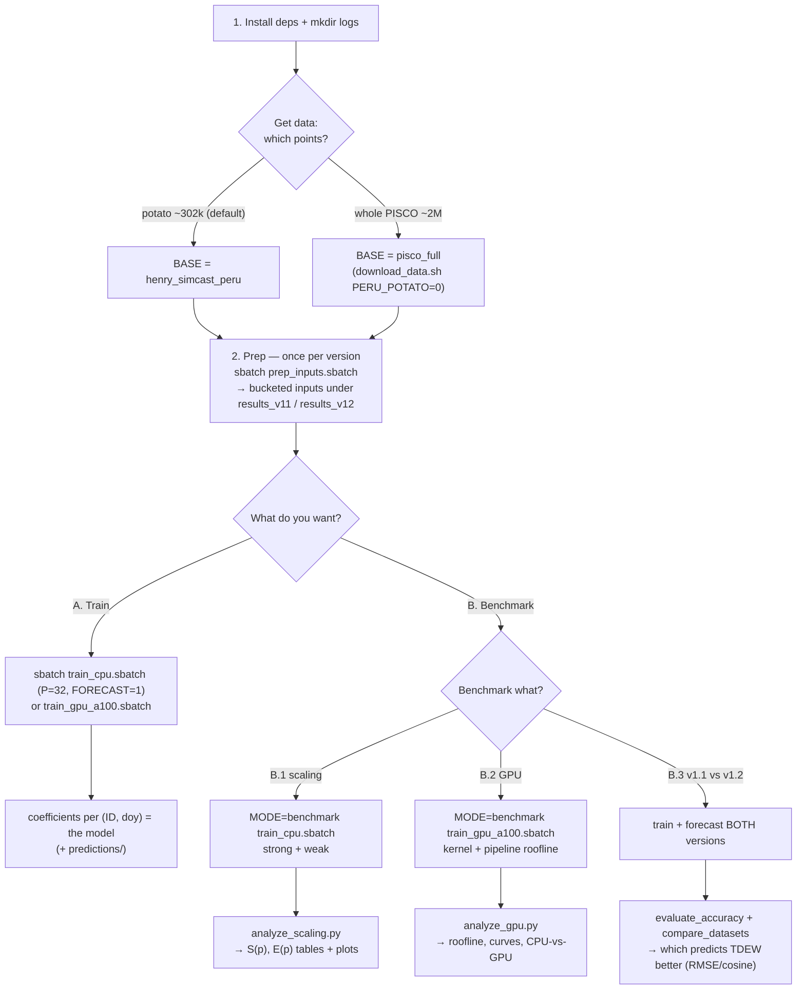

# HPC_code — run TDEW on SLURM / GPU

This folder runs the TDEW pipeline on a cluster (SLURM, CPU multi-node) or a GPU, plus the
benchmark harness for the scaling study in `tdew_estimation_pram.qmd`. Local single-machine
execution lives in [`../Local/`](../Local/); the shared algorithm lives in the `tdew_estimation`
package and is used unchanged by both.

**The whole workflow is four steps:** _install_ → _get the data_ → _prep once_ → then pick a
goal: **[A] Train the model** (get coefficients you can use) or **[B] Benchmark** (does it scale,
and which PISCOt version predicts dewpoint better). Steps 1–2 are shared; A and B are independent.

## Workflow at a glance



Every box is a `python`/`sbatch` command from the steps below. The cluster builders in `hpc.py`
inject a Dask `client` (`local`/`slurm`/`cuda`) into the *same* runners, so the work and outputs
are identical — only the processor count `P` changes.

## What's here

| File | Purpose |
|------|---------|
| `hpc.py` | Cluster builders: `make_slurm_cluster` (dask-jobqueue), `make_local_cuda_cluster` (dask-cuda), `make_local_cpu_cluster` (baseline / `P=1`). Each returns a live `Client`. |
| `nc_to_point_parquet.py` | Extract PISCOt `.nc` rasters → per-point monthly parquet (Python/xarray port of the R/`terra` step). Potato-points or full-grid via `--peru-potato`. |
| `make_subset.py` | Filter the data to the first N IDs → a drop-in `--base` subset (for the CPU benchmark + quick tests). |
| `sbatch/bench_cpu_family.sbatch` | CPU scaling **family** in one job: strong p-sweep at several N + weak, → one CSV for `analyze_scaling.py --by-size`. |
| `sbatch/download_data.sh` | Download the 3 figshare PISCOt products (`.nc`) and run the extractor per variable. Resume-safe, idempotent. |
| `prep_inputs.py` / `sbatch/prep_inputs.sbatch` | **Step 2 (prep)**: build the reusable bucketed inputs (climatology, bucket-year dataset, shards) — *no training_. `--n-workers` parallelises it. |
| `run_training_hpc.py` | Train entrypoint: build `local\|slurm\|cuda` cluster → train coefficients (+ optional forecast). |
| `sbatch/train_cpu.sbatch` | CPU driver job — `MODE=train` (one run) or `MODE=benchmark` (scaling sweep). |
| `sbatch/train_gpu_a100.sbatch` | Single-GPU driver job (one A100 / MIG slice; `client=None`, no dask-cuda) — `MODE=train\|benchmark`. |
| `benchmark_scaling.py` | Scaling driver: fresh cluster per `(p, trial)` → time the runners → append timing rows to a CSV. |
| `benchmark_gpu_kernel.py` / `benchmark_gpu_pipeline.py` | Single-GPU kernel + full-pipeline **roofline** (GFLOPS, arithmetic intensity). |
| `analyze_scaling.py` / `analyze_gpu.py` | Turn the CSVs into markdown tables + PNG plots (speedup/efficiency; roofline / CPU-vs-GPU). |
| `evaluate_accuracy.py` / `compare_datasets.py` | Score forecast skill vs observed `TD` and compare two PISCOt versions (RMSE/MAE/bias/Pearson r/cosine). |
| `requirements-gpu.txt` | Optional GPU deps (cu12 wheels + dask-jobqueue). |
| `_synth.py` / `tests/` | Synthetic dataset generator + pytest smoke tests (`pytest HPC_code`). |

---

# 1. Setup (once)

**Install** (Python ≥3.11; pick the extras you need):

```bash
pip install -e ".[hpc,benchmark]"     # core + SLURM (dask-jobqueue) + plots — the CPU jobs
pip install -e ".[gpu]"               # + cupy-cuda12x — the GPU jobs (Linux, CUDA 12.x)
pip install -e ".[netcdf]"            # xarray/netCDF4/geopandas — only to extract .nc yourself
mkdir -p logs    # REQUIRED: SLURM opens logs/*.out before the job body runs
```
Core deps are CPU-only and light (numpy/pandas/pyarrow/statsmodels/tqdm/dask); GPU
(`cupy`), extraction (`geopandas`/`xarray`), and multi-GPU (`dask-cuda`, `.[multigpu]`) are
isolated in extras so a plain `pip install -e .` works anywhere.

**Get the data.** Which *points* you run on is fixed when the data is extracted — pick `BASE`:

```bash
# Potato planting zones only (~302k points) — the science target, already extracted on the dev box:
export BASE=/media/ppalacios/Data/henry_simcast_peru

# OR the whole PISCO grid (~2M points, ~6.6× the work) — extract ONCE into a SEPARATE base:
PERU_POTATO=0 BASE=/media/ppalacios/Data/pisco_full bash HPC_code/sbatch/download_data.sh
export BASE=/media/ppalacios/Data/pisco_full
```

Everything below operates on whatever `BASE` points at — nothing else changes between the two.

# 2. Prep the data — once per dataset version (needed for BOTH goals)

Prep pays the expensive `TD`↔`TMIN` merge **once** and reshapes the data into compact per-bucket
files, so training/benchmarking just read them. It produces `daily_climatology.parquet`,
`bucketed_training_data/`, `climatology_by_bucket/`, `future_tmin_by_bucket/` under `--results`.
**The dataset version is chosen here** (via `--tmin-var`); downstream jobs only point at `--results`.

```bash
# PISCOt v1.1 and v1.2 into separate result roots (one process per training year):
BASE="$BASE" RESULTS=results_v11 TMIN_VAR=tmin_v11 sbatch HPC_code/sbatch/prep_inputs.sbatch
BASE="$BASE" RESULTS=results_v12 TMIN_VAR=tmin_v12 sbatch HPC_code/sbatch/prep_inputs.sbatch
```

(Direct, no SLURM: `python HPC_code/prep_inputs.py --base "$BASE" --results results_v12
--tmin-var tmin_v12 --train-start 1981 --train-end 2016 --pred-start 2017 --pred-end 2020
--num-buckets 1024 --n-workers 32`. Use `--num-buckets 1024` so `B ≥ 4·p_max` for the CPU sweep.)

---

# A. Train the model

**Use this when you want the model itself.** Training fits, for every location `ID` and every
day-of-year, a small weighted regression of the `TD` anomaly on `TMIN` — the output is a table of
**coefficients per `(ID, doy)`** (`const_anom, TMIN_anom_coeff, TD_anom_lag1, TD_anom_lag2,
TMIN_anom_lag1, r_squared_anom`). That table *is* the fitted model: anyone can apply it to a new
`TMIN` series to estimate dewpoint. It trains on the **whole** dataset (all IDs, full years).

```bash
# CPU (multi-node fleet, P=32 workers) + forecast future TD:
BASE="$BASE" RESULTS=results_v12 P=32 FORECAST=1 sbatch HPC_code/sbatch/train_cpu.sbatch

# OR the single GPU (much faster for the fit; same numbers):
BASE="$BASE" RESULTS=results_v12 FORECAST=1 sbatch HPC_code/sbatch/train_gpu_a100.sbatch
```

**Outputs** under `results_v12/`: `llr_coeffs_anomaly_dataset/id_bucket=XXXX/coeffs.parquet`
(the model) and — with `FORECAST=1` — `predictions/` (+ combined `td_predictions.parquet`).
Use `results_v11` for v1.1. (`FORECAST` is optional; drop it if you only need coefficients.)

---

# B. Benchmark

Benchmarking answers two questions: **(B.1–B.2) does the pipeline get faster with more hardware**,
and **(B.3) which PISCOt version predicts dewpoint better**. Each block below says what it measures.

## B.1 — Does it scale? (CPU strong & weak scaling)

**What this measures.** For a phase timed at `p` workers we report execution time `T(p)`, **speedup**
`S(p) = T(1)/T(p)` ("how many × faster with `p` workers"), and **efficiency** `E(p) = S(p)/p`
("what fraction of each worker was useful"; ideal = 1). *Strong* scaling fixes the problem and adds
workers — _"can the cluster finish this sooner?"_ *Weak* scaling grows the problem with the workers
(`n(p) = n0·p`) — _"if we double both, does the time stay flat?"_ Speedup is expected to rise while
`p ≤ B` (bucket count) then flatten.

```bash
# strong scaling
MODE=benchmark BASE="$BASE" RESULTS=results_v12 DATASET_LABEL=v12 \
    P_LIST=1,2,4,8,16,32 TRIALS=3 NUM_BUCKETS=1024 \
    sbatch HPC_code/sbatch/train_cpu.sbatch
# weak scaling
MODE=benchmark BENCH_MODE=weak BASE="$BASE" RESULTS=results_v12 DATASET_LABEL=v12 \
    P_LIST=1,2,4,8,16,32 N0=4 sbatch HPC_code/sbatch/train_cpu.sbatch

python HPC_code/analyze_scaling.py --csv results_v12/scaling_cpu_v12.csv \
    --out-dir results_v12/cpu_plots --md-out results_v12/cpu_tables.md
```

→ `results_v12/cpu_tables.md` (T, S, E tables) + `cpu_plots/` (`speedup_*`, `efficiency_*`, `time_*`.png).

## B.2 — How fast is the GPU? (roofline)

**What this measures.** The GPU does the fit in three stages — **assemble** (build the per-`(ID,doy)`
5×5 normal equations), **convolve** (the day-of-year window), **solve** (batched 5×5 Cholesky). For
each we report time, throughput (fits/s), achieved **GFLOPS**, and **arithmetic intensity**
`AI = FLOPs/byte`, swept over problem size `M = #fits` with one curve per `N = IDs/bucket`. The
**roofline** plots achieved GFLOPS against AI with the device's compute and memory-bandwidth
ceilings: our AI (~0.1–0.6) sits far left of the ridge, so the pipeline is **memory-bandwidth
bound** — speed comes from HBM bandwidth and batch width, not FP64 throughput. KHIPU has one A100
MIG slice, so there is no multi-GPU sweep; this *is* the single-GPU performance story.

```bash
# one job runs the kernel sweep + full-pipeline roofline + the single-GPU end-to-end point:
MODE=benchmark BASE="$BASE" RESULTS=results_v12 DATASET_LABEL=v12 \
    sbatch HPC_code/sbatch/train_gpu_a100.sbatch
    # -> results_v12/{gpu_kernel.csv, gpu_pipeline.csv, scaling_gpu.csv}

python HPC_code/analyze_gpu.py --kernel-csv results_v12/gpu_kernel.csv \
    --pipeline-csv results_v12/gpu_pipeline.csv --scaling-csv results_v12/scaling_gpu.csv \
    --peak-fp64-gflops 4200 --out-dir results_v12/gpu_plots --md-out results_v12/gpu_report.md
```

→ `gpu_report.md` + `gpu_plots/` (`gpu_roofline.png`, `gpu_pipeline_*_vs_M.png`,
`gpu_block_tuning.png`, `gpu_throughput.png`, `cpu_vs_gpu.png`). Confirm the MIG slice's FP64 peak /
HBM bandwidth on the real device — the benchmark also measures bandwidth empirically.

## B.3 — Which PISCOt version predicts TDEW better? (v1.1 vs v1.2)

**What this measures.** Benchmarking the *data's* predictive quality, not speed. We train both TMIN
versions on a window, **forecast a withheld window**, and score the predicted `TD` against the
**observed** `TD`: RMSE, MAE, bias (pred−obs), Pearson `r`, and **cosine similarity** (the metric the
inspiring paper used). The lower-RMSE version forecasts dewpoint better. The withheld window must
have observed `td` *and* future `TMIN` for **both** versions, so it lies inside the v1.1∩v1.2 overlap
(**1981–2016**) — e.g. train 1981–2014, forecast 2015–2016.

```bash
# prep BOTH versions with the held-out split (separate roots so production runs aren't touched):
for V in v11 v12; do
  python HPC_code/prep_inputs.py --base "$BASE" --results cmp_$V \
      --td-var td --tmin-var tmin_$V \
      --train-start 1981 --train-end 2014 --pred-start 2015 --pred-end 2016 \
      --num-buckets 1024 --n-workers 32        # or: sbatch sbatch/prep_inputs.sbatch
done

# train + FORECAST both (forecast is required — predictions are what gets scored):
BASE="$BASE" RESULTS=cmp_v11 P=32 FORECAST=1 sbatch HPC_code/sbatch/train_cpu.sbatch
BASE="$BASE" RESULTS=cmp_v12 P=32 FORECAST=1 sbatch HPC_code/sbatch/train_cpu.sbatch

# 1) skill vs OBSERVED td — which version forecasts TD better:
python HPC_code/evaluate_accuracy.py \
    --pred-a cmp_v11/predictions --pred-b cmp_v12/predictions \
    --obs "$BASE/td/Outputs" --label-a v1.1 --label-b v1.2 \
    --out-dir cmp/plots --md-out cmp/accuracy_v11_v12.md

# 2) how the two models' coefficients + predictions agree (+ cosine):
python HPC_code/compare_datasets.py \
    --coeffs-a cmp_v11/llr_coeffs_anomaly_dataset --coeffs-b cmp_v12/llr_coeffs_anomaly_dataset \
    --pred-a cmp_v11/predictions --pred-b cmp_v12/predictions \
    --label-a v1.1 --label-b v1.2 --out-dir cmp/plots --md-out cmp/compare_v11_v12.md
```

→ `cmp/accuracy_v11_v12.md` (the "Lower RMSE" verdict — which version wins) and
`cmp/compare_v11_v12.md` (coefficient/prediction agreement), plus PNGs in `cmp/plots/`.

---

# Run on KHIPU (end-to-end)

KHIPU limits: account `postgrado`; **32 cores, 98 GB RAM, 1 A100 MIG slice
(`--gres=gpu:a100_3g.20gb:1`, the sbatch default), 8 h walltime.** A full `p=1` CPU baseline on
300k IDs is ~80 h, so **benchmark CPU on a subset** (the scaling ratio is size-independent) and
**run/benchmark 300k on the GPU** (~15–25 min). Strategy: **prep locally → transfer the bucketed
inputs → 3 jobs** (each ≤ 8 h). Save all outputs under a persistent path (`$OUT=…/results`),
never `/tmp`.

### 0. One-time KHIPU setup
```bash
git clone https://github.com/CENTRO-INTERNACIONAL-DE-LA-PAPA/tdew_estimation.git
cd tdew_estimation && git checkout develop
module load python/3.11           # 3.11+ (adjust to KHIPU's module name)
python3 -m venv .venv && source .venv/bin/activate && pip install -U pip
pip install -e ".[hpc,benchmark]"  # CPU/SLURM + plots
pip install -e ".[gpu]"            # cupy-cuda12x (GPU jobs)
```
Then set the env line in each `sbatch` (`source .../tdew_estimation/.venv/bin/activate`) or pass
`PYTHON=.../.venv/bin/python` to `sbatch`. KHIPU has no `$SCRATCH`; use a real path, e.g.
`RUN=/home/$USER/tdew_run`, in place of `$OUT`/`$SCRATCH` below.

### 1. Local: subset, prep, transfer
```bash
FULL=/media/ppalacios/Data/henry_simcast_peru          # your data
# CPU-benchmark subset (4000 IDs, v12) -> prep at B=256
python HPC_code/make_subset.py --base "$FULL" --out "$FULL/sub4k" --n-ids 4000 \
    --vars td,tmin_v12 --year-range 1981,2016
python HPC_code/prep_inputs.py --base "$FULL/sub4k" --results "$FULL/res_cpu_v12" \
    --tmin-var tmin_v12 --train-start 1981 --train-end 2016 --no-future --num-buckets 256 --n-workers 24
# FULL 300k v12 (production model + GPU end-to-end point) -> B=1024
python HPC_code/prep_inputs.py --base "$FULL" --results "$FULL/res_v12_300k" --tmin-var tmin_v12 \
    --train-start 1981 --train-end 2016 --pred-start 2017 --pred-end 2018 --num-buckets 1024 --n-workers 24
# Comparison subset (20k IDs, both versions, HELD-OUT split) -> B=512
python HPC_code/make_subset.py --base "$FULL" --out "$FULL/cmp20k" --n-ids 20000 \
    --vars td,tmin_v11,tmin_v12 --year-range 1981,2015
for V in v11 v12; do python HPC_code/prep_inputs.py --base "$FULL/cmp20k" --results "$FULL/cmp_$V" \
    --tmin-var tmin_$V --train-start 1981 --train-end 2014 --pred-start 2015 --pred-end 2015 \
    --num-buckets 512 --n-workers 24 ; done
# transfer one tar stream per result root (avoids 1000s of small files)
for d in res_cpu_v12 res_v12_300k cmp_v11 cmp_v12; do
  tar -C "$FULL/$d" -cf - . | zstd | ssh khipu "mkdir -p \$SCRATCH/$d && zstd -d | tar -C \$SCRATCH/$d -xf -"; done
```

### 2. KHIPU: three jobs (`mkdir -p logs` first)
```bash
# JOB A — CPU scaling family (standard, 32c): N={1000,2000,4000} x p={1..32}, ~4.5 h
RESULTS=$SCRATCH/res_cpu_v12 N_LIST=64,128,256 P_LIST=1,2,4,8,16,32 \
    sbatch HPC_code/sbatch/bench_cpu_family.sbatch
python HPC_code/analyze_scaling.py --by-size --csv $SCRATCH/res_cpu_v12/scaling_cpu_v12.csv \
    --out-dir $SCRATCH/res_cpu_v12/cpu_family_plots --md-out $SCRATCH/res_cpu_v12/cpu_family_tables.md

# JOB B — GPU roofline + 300k model (gpu): roofline, then train the 300k model, <1 h
MODE=benchmark RESULTS=$SCRATCH/res_v12_300k sbatch HPC_code/sbatch/train_gpu_a100.sbatch
MODE=train FORECAST=1 RESULTS=$SCRATCH/res_v12_300k sbatch HPC_code/sbatch/train_gpu_a100.sbatch
python HPC_code/analyze_gpu.py --kernel-csv $SCRATCH/res_v12_300k/gpu_kernel.csv \
    --pipeline-csv $SCRATCH/res_v12_300k/gpu_pipeline.csv --scaling-csv $SCRATCH/res_v12_300k/scaling_gpu.csv \
    --peak-fp64-gflops 4200 --out-dir $SCRATCH/res_v12_300k/gpu_plots --md-out $SCRATCH/res_v12_300k/gpu_report.md

# JOB C — v1.1 vs v1.2 comparison on GPU (gpu): train+forecast both 20k held-out, ~2-3 h
for V in v11 v12; do MODE=train FORECAST=1 RESULTS=$SCRATCH/cmp_$V \
    sbatch HPC_code/sbatch/train_gpu_a100.sbatch ; done
python HPC_code/evaluate_accuracy.py --pred-a $SCRATCH/cmp_v11/predictions --pred-b $SCRATCH/cmp_v12/predictions \
    --obs $SCRATCH/cmp20k/td/Outputs --label-a v1.1 --label-b v1.2 \
    --out-dir $SCRATCH/cmp/plots --md-out $SCRATCH/cmp/accuracy_v11_v12.md
```
`make_subset.py` builds the ID subsets; `bench_cpu_family.sbatch` runs the whole N×p family in one
job; `analyze_scaling.py --by-size` makes the per-N Time/Speedup/Efficiency curves + weak diagonals.
The comparison is on **20k IDs** (statistically ample; forecast is CPU-bound, so this keeps Job C
inside 8 h). Job B's 300k train doubles as your production model.

---

# Reference (knobs & internals)

## Changing SLURM parameters

Each `sbatch/*.sbatch` file begins with `#SBATCH` directives that request the *driver* job's
resources. Change them **two ways**: edit the line in the file (permanent for your site), or
**override at submit time** — a command-line flag beats the file:

```bash
sbatch -p mypartition -A myaccount -c 16 --mem=32G -t 02:00:00 \
       HPC_code/sbatch/train_cpu.sbatch          # overrides the #SBATCH lines for this run
```

| `#SBATCH` directive | What it requests | KHIPU default | Override flag |
|---|---|---|---|
| `--partition` | the queue | `standard` (CPU) / `gpu` (GPU) | `-p <queue>` |
| `--account` | billing account | `postgrado` | `-A <account>` |
| `--cpus-per-task` | cores on the driver node | `32` | `-c <n>` |
| `--mem` | RAM for the job | `64G` (CPU) / `32G` (GPU) | `--mem=<n>G` |
| `--gres` | GPUs | `gpu:a100_3g.20gb:1` (GPU job) | `--gres=<spec>` |
| `--time` | walltime cap | `04:00:00` (KHIPU max `08:00:00`) | `-t <hh:mm:ss>` |
| `--nodelist` | pin to a node | `ag001` (GPU) | `-w <node>` (or delete the line) |

**Driver vs worker fleet.** The `#SBATCH` lines size the **driver** (the one process that runs the
scheduler + Python). With `--cluster slurm` the actual **worker fleet** is requested *separately* by
dask-jobqueue and sized by the `--slurm-cores / --slurm-memory / --slurm-walltime` flags inside the
sbatch body (currently `16` cores / `64GB` / `02:00:00` per worker job) — edit those to change the
fleet, not the `#SBATCH` block. With `--cluster local` there is no fleet: workers are processes on
the driver node, bounded by `--cpus-per-task`.

**Try it locally first.** On a single machine / local SLURM, add `CLUSTER=local` to the CPU jobs
(runs on one node instead of spawning a dask-jobqueue fleet) and submit with `sbatch -p debug`. A
local SLURM usually has **no GPU GRES**, so run the GPU benchmark/train *directly* with
`python HPC_code/...` (or `benchmark_gpu_*` + `run_training_hpc.py --gpu-train`). To rehearse the
whole flow cheaply, point `BASE` at a small subset of IDs.

**Cluster backends** (`--cluster`): `local` = single-node `LocalCluster` sized to `p`; `slurm` =
multi-node `dask-jobqueue` fleet of `p` workers (needs `--slurm-queue`/`--slurm-account`); `cuda` =
`dask-cuda` (future multi-GPU; not used on KHIPU's single GPU).

**sbatch environment variables** (override on the command line):

| Var | Used by | Meaning |
|---|---|---|
| `MODE` | train_cpu / train_gpu | `train` (default) or `benchmark` |
| `CLUSTER` | train_cpu | `slurm` (default) or `local` (single node / testing) |
| `P` | train_cpu (train) | worker processes for a training run |
| `P_LIST`, `TRIALS` | *_benchmark | processor counts to sweep; repeats per point |
| `BENCH_MODE`, `N0` | train_cpu benchmark | `strong` (default) or `weak`; weak base buckets/proc |
| `NUM_BUCKETS` | benchmark | how many prepped buckets to use (≤ the B you prepped; `≥ 4·max(p)`) |
| `FORECAST` | train | `1` to also run the forecast phase |
| `DATASET_LABEL` | benchmark | tag written into the CSV (`v11`/`v12`) |
| `N_WORKERS`, `TMIN_VAR` | prep_inputs | parallel years; which TMIN version to prep |
| `SYNTH` | benchmark | build a synthetic dataset first (no real data needed) |

`run_training_hpc.py` does *one* run at a fixed `P`; `benchmark_scaling.py` *sweeps* `P` and writes
the scaling CSV — they share `train_cpu.sbatch` via `MODE`. The sbatch files are **preset for KHIPU**
(`account=postgrado`; CPU `standard`; GPU `gpu`/`ag001`/`gpu:a100_3g.20gb:1`; `cpu=32`,
`08:00:00`); override per site (`sbatch -p <part> -A <acct>`).

**Tests:** `pytest HPC_code` (CuPy/RAPIDS-free; GPU tests `importorskip`).

> **Caveats.** Confirm the MIG slice's FP64/HBM ceilings on the real GPU node. The "v1.1 vs v1.2"
> finding is **SME-validate-before-publish**, and any generative-AI assistance should be disclosed.
