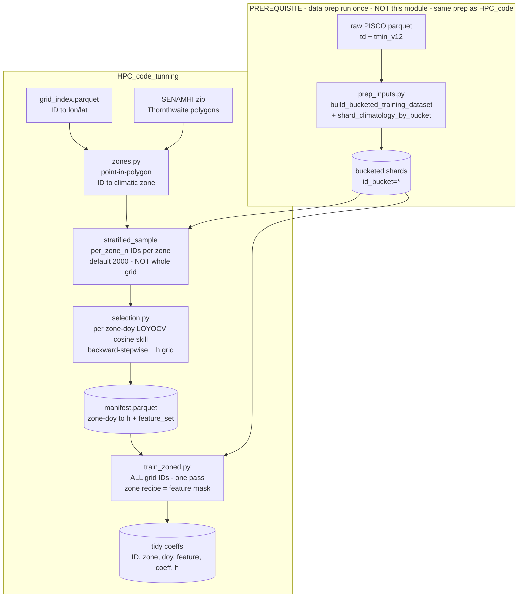

# `HPC_code_tunning` — GPU feature/`h` tuning + per-zone TDEW models

The production TDEW-from-TMIN model fits a per-`(ID, day-of-year)` weighted local linear
regression (WLS) on climate **anomalies** with a **fixed** feature set
(`const, TMIN_anom, TD_anom_lag1, TD_anom_lag2, TMIN_anom_lag1`) and a **fixed** DOY
half-window `h = 11`. Neither `h` nor the feature set has ever been tuned, and one global
model is applied to all of Peru despite very heterogeneous microclimates.

This module, GPU-accelerated on the workstation, does three things:

1. **grid-searches `h`** and
2. runs **multitask backward-stepwise feature selection** (features chosen jointly across
   grid points, coefficients fit per grid point) under a **leave-one-year-out CV (LOYOCV)
   cosine-skill** objective (SubseasonalRodeo "MultiLLR", arXiv:1809.07394), producing a
   feature recipe **and** an `h` per **SENAMHI climate `zone × doy`**; then
3. **trains the full grid once**, each `(ID, doy)` using its zone's recipe.

Both the feature recipe and `h` are selected per `zone × doy` (there is no "season"
bucketing). Set `--granularity zone` for one recipe + one `h` per zone instead.

## Pipeline at a glance



**Reading the diagram:** the `prep` box is a **prerequisite** done outside this module (the
same bucketing the benchmark uses) — its shards feed *both* selection and training. Zones +
a small **per-zone sample** drive selection; the resulting recipe manifest then drives a
**single full-grid training pass over every ID**, where the zone is only a feature-mask
lookup.

## Relationship to `HPC_code` (the benchmark / production trainer)

This module **reuses** `HPC_code` rather than replacing it: the batched WLS solver
(`gpu_train.solve_bucket_reference`), the circular tricube weight/convolution, and the GPU
cluster builder (`hpc.make_local_cuda_cluster`). It does **not** re-prep or re-bucket data.
The difference is the *job*:

| | `HPC_code` (benchmark / production) | `HPC_code_tunning` (this module) |
|---|---|---|
| Feature set | **fixed 5** (`const, TMIN_anom, TD_anom_lag1/2, TMIN_anom_lag1`) | tunable, **selected per `zone × doy`** |
| DOY window `h` | **fixed 11** | **grid-searched** per `zone × doy` |
| Objective | fit only | **LOYOCV cosine skill** (keeps a year axis) |
| Climatic zones | none — one global model | SENAMHI Thornthwaite zones |
| IDs used | all | selection: **sample** (`per_zone_n`/zone); training: **all** |
| Coeff output | wide (5 columns) | **tidy/long** (`feature_name` rows) |

## What runs where

Selection runs **in-process on the single visible GPU** (it is bucketed/sequential and
needs no `dask-cuda`). The full-grid training pass can fan out over GPUs with
`--cluster cuda` (`HPC_code.hpc.make_local_cuda_cluster`), or run in-process (`--cluster none`).

## Module layout

| file | role |
|------|------|
| `zones.py` | extract the SENAMHI Thornthwaite shapefile from its zip; point-in-polygon `ID → zone`; stratified per-zone ID sampler. |
| `feature_spec.py` | `FeatureRegistry` (declarative `const` / `<VAR>_anom` / `<VAR>_anom_lag<k>` parsing), `TuningConfig`, and the F-generic CPU column builder. |
| `assemble_generic.py` | F-generic GPU assembly of per-`(ID, year, doy)` sufficient statistics + raw scoring rows; generic circular tricube/gaussian DOY convolution; year-free assembly for training. |
| `loyocv.py` | one-step LOYOCV cosine-skill primitive (leave-one-year-out **by subtraction** `A_full − A_year`), GPU-batched, ID-chunk-additive segment sums. |
| `selection.py` | multitask backward-stepwise selection + `h` grid per zone; emits the recipe manifest. |
| `manifest.py` | read/write the `(zone × doy) → (h, feature_set)` recipe manifest + a fast lookup with per-zone fallback. |
| `train_zoned.py` | single-pass full-grid training applying each grid point's zone feature mask (zero-column trick); tidy/long coeff output. |
| `run_tuning_hpc.py` | CLI entrypoint wiring zones → selection → zoned training. |

## Four tricks that make it tractable

1. **Assemble-once, subset-by-indexing.** Per zone the Gram tensor is assembled for the
   *full* candidate superset (`S_xx[F,F]`, `S_xy[F]`, `S_yy`); every candidate subset's
   normal equations are index-selected sub-blocks. Backward-stepwise never re-reads data.
2. **LOYOCV by subtraction.** A `year` axis is kept before the DOY convolution, so
   `A_full = Σ_y A_y` and leave-one-out for year `y*` is `A_full − A_{y*}`. No per-fold
   re-scan. (Verified exact in `tests/test_loyocv_math.py`.)
3. **One-step scoring.** Held-out predictions are a gathered `X · β`; the recursive
   `forecast.py` is *not* used for scoring. Cosine is computed on anomalies (uncentred,
   paper-style — same as `HPC_code.compare_datasets._cosine`).
4. **`h` rides the convolution only.** Raw day-sums are assembled once; each candidate `h`
   re-runs the cheap circular tricube convolution.

And in training: **zones are a per-`(ID, doy)` feature mask, not a data partition.** A
single bucket-parallel pass trains the whole grid; each `(ID, doy)` solves the superset
Gram **sub-block** for its zone's selected features, with dropped columns zeroed
(`A[j,j]=1`, off-diag & `b[j]=0` → `β[j]=0`) so the batched solve stays a uniform `F×F`.
Verified exact against a reduced sub-block solve in `tests/test_zone_mask_solve.py`.

### Assemble-once caveat (important)

Because the Gram is assembled **once over the full candidate pool**, the per-`(ID, doy)`
`dropna` is over *all* candidate features. A subset recipe is therefore fit on the rows
valid for the whole superset (e.g. lag-30 drops the first 30 days of each ID's series),
not on the subset's own maximal sample. This is the deliberate cost of the single-pass
design; coefficients differ negligibly from a from-scratch subset fit (a few boundary
rows). `tests/test_train_zoned_e2e.py` pins training against the matching sub-block solve.

## Memory

Selection processes each zone's ID sample in **chunks of `--id-chunk` IDs** so the
per-chunk device tensors fit. Peak device memory during selection is dominated by the
per-year convolved Gram tensor:

```
S_xx tensor ≈ id_chunk × n_years × 366 × F² × 8      (float64)
peak        ≈ 4–5 × that   (convolution output + cp.roll temporaries)
```

e.g. `id_chunk=96`, `n_years=36`, `F=11` → `S_xx` ≈ 1.2 GB, peak ≈ 5–6 GB. **Measured on the
12 GB A2000: `id_chunk=128` is the ceiling at `F=11`, `256` OOMs** — hence the default
`--id-chunk 96` (safe headroom). Because the cosine segment sums are **additive across ID
chunks**, chunking is exact: raise `--per-zone-n` freely (more chunks, not more peak memory)
and only size `--id-chunk` to the GPU. On a bigger card (A100 40/80 GB) push `--id-chunk`
to 512+. Training memory is `O(N_bucket × 366 × F²)` per bucket, kept small by a large
prep-time `--num-buckets`.

## Runtime estimate (single RTX A2000, rough)

Micro-benchmarked on the workstation: one selection convolution of a
`[96, 36, 366, 11, 11]` chunk at `h=11` ≈ **0.84 s**; one training-bucket solve of ~89 k
`(ID,doy)` cells ≈ **19 ms**, its convolution ≈ **59 ms**.

| phase | work | ballpark (1× A2000) |
|---|---|---|
| **Selection** | 36 zones × 4 `h` × ~5 backward-stepwise rounds, each a pass over `2000/96 ≈ 21` chunks (convolution + scatter bound) | **~5–10 h** |
| **Training** | one pass over ~2M IDs = ~8k buckets × (assemble + up to 4 `h` convolutions + solve + shard I/O) | **~1–3 h** |
| **Total tuning** | selection + training | **~half a day to a day** |

Not included: the one-time **prep (P-1)** — ~1 TB extraction + bucketing of the national
grid — which is itself many hours (see `HPC_code/RUNBOOK.md`).

Selection cost scales linearly in `len(h_grid)`, `per_zone_n`, and number of zones, so the
cheap dials are: fewer `h` values, `--per-zone-n 1000`, or `--granularity zone`. Training
parallelises across GPUs with `--cluster cuda` (≈ ÷ number of GPUs). These are order-of-
magnitude estimates from the convolution micro-benchmark, not a full timed run — time one
zone first to calibrate.

## Candidate pool

Default (no data re-prep needed): `const, TMIN_anom, TMIN_anom_lag{1,2,7,30},
TD_anom_lag{1,2,3,7,30}`. `TD_anom` is always the target, so `TD` enters only through
lags. TMAX/PREC candidates are deferred — they need a shard-builder change (plan P7).

## Runbook

Run everything with the project venv (`.venv/bin/python`, has CuPy + a CUDA device).
`$BASE` is the results root holding the bucketed shards.

### Step 0 — data prep (PREREQUISITE, once, NOT this module)

This module does **not** download, prep, or bucket data. Produce the shards first with the
standard prep — see `HPC_code/RUNBOOK.md`. You need, under `$BASE`:

```
$BASE/bucketed_training_data/id_bucket=*/     # ID, FECHA, TD, TMIN, doy
$BASE/climatology_by_bucket/id_bucket=*/climatology.parquet   # ID, doy, TD_clim, TMIN_clim
```

For the full national grid, prep with `download_data.sh PERU_POTATO=0` (~2M points +
`grid_index.parquet`) then `prep_inputs.py` with predictor `tmin_v12`, target `td`, train
years `1981 2016`, and a **large `--num-buckets`** (≈8192) so training stays in GPU memory.
Verify there is ≥ ~1 TB free before starting. **Check first:**

```bash
ls "$BASE"/bucketed_training_data/ | head        # buckets exist?
ls "$BASE"/climatology_by_bucket/ | head
```

### Step 1 — one-shot full pipeline (zones → select → train)

```bash
.venv/bin/python -m HPC_code_tunning.run_tuning_hpc \
    --base       "$BASE" \
    --coords     "$BASE"/grid_index.parquet \
    --zones-zip  ~/Downloads/clasif_clima_peru.zip \
    --tmin-var tmin_v12 --train-years "1981 2016" \
    --per-zone-n 2000 --id-chunk 256 --h-grid 7,11,15,21 \
    --granularity doy --stage all --cluster cuda
```

This builds/caches `$BASE/zone_table.parquet`, writes `$BASE/tuning/manifest.parquet`, then
trains the full grid into `$BASE/tuning/zoned_coeffs/`.

### Step 1 (alt) — run the stages separately

Useful because **selection is minutes** (a per-zone sample) while **training is multi-hour**
(the whole ~2M grid). The manifest persists between them.

```bash
# 1a. tune recipes only  (single GPU, in-process)
.venv/bin/python -m HPC_code_tunning.run_tuning_hpc --base "$BASE" \
    --coords "$BASE"/grid_index.parquet --zones-zip ~/Downloads/clasif_clima_peru.zip \
    --tmin-var tmin_v12 --train-years "1981 2016" \
    --per-zone-n 2000 --id-chunk 256 --h-grid 7,11,15,21 --stage select

# 1b. train the grid from that manifest  (fan out over GPUs)
.venv/bin/python -m HPC_code_tunning.run_tuning_hpc --base "$BASE" \
    --tmin-var tmin_v12 --train-years "1981 2016" --stage train --cluster cuda --overwrite
```

`--stage train` re-reads the cached `zone_table.parquet` + `manifest.parquet`, so `--coords`
/`--zones-zip` are not needed the second time.

### Step 2 — inspect the outputs

```bash
BASE="$BASE" .venv/bin/python - <<'PY'
import os, glob, pandas as pd
from collections import Counter
base = os.environ["BASE"]
m = pd.read_parquet(f"{base}/tuning/manifest.parquet")
print("recipes:", len(m), "| zones:", m.zone_id.nunique())
print(m.h.value_counts().sort_index())                 # which h won
c = Counter()
m.feature_list.str.split(",").apply(c.update)
print("feature retention:", dict(c.most_common()))     # TMIN_anom should dominate
tidy = pd.concat(map(pd.read_parquet,
                     glob.glob(f"{base}/tuning/zoned_coeffs/id_bucket=*/coeffs.parquet")))
print("tidy coeff rows:", len(tidy), "| IDs:", tidy.ID.nunique())
PY
```

Sanity check: the contemporaneous `TMIN_anom` should be retained almost everywhere; if it is
not, something is wrong with the anomalies or the sample.

### Dev / smoke run

No cluster and no real zones needed — point `--coords` at a small `grid_index.parquet` (or a
point `.shp`), lower `--per-zone-n`, and use `--cluster none`. The test-suite fixtures build
a fully synthetic bucketed dataset if you just want to exercise the code:

```bash
.venv/bin/python -m pytest HPC_code_tunning/tests -q
```

### Inputs & defaults

Inputs are the bucketed shards from Step 0. Predictor defaults to `tmin_v12`, target to the
shared `td` product (overlap 1981–2016), mirroring Job C. Key knobs: `--per-zone-n` (sample
per zone), `--id-chunk` (GPU memory), `--h-grid`, `--candidates`, `--granularity {doy,zone}`,
`--tol`, `--cluster {none,cuda}`, `--stage {select,train,all}`.

## Outputs

* `manifest.parquet` — `[zone_id, zone_label, doy, h, feature_list, n_features, skill]`
  (one row per `zone × doy`, or per zone with `doy = -1` when `--granularity zone`).
* `zoned_coeffs/id_bucket=*/coeffs.parquet` — **tidy/long** coefficients
  `[ID, zone_id, doy, feature_name, coeff, r_squared_anom, h]`.

## Deploy gap (plan P6 — not yet implemented)

`tdew_estimation/forecast.py` hard-codes the 5 canonical coefficient columns, so it cannot
yet consume the tidy per-`(ID, doy)` recipes to produce the TD field. Generalising it to
an arbitrary per-`(ID, doy)` feature set + manifest is required before the tuned
coefficients can be used for prediction.

**Parallelism opportunity.** The forecast is autoregressive **only because of the
`TD_anom_lag*` features**: a predicted TD feeds the next day's lag, forcing a sequential
recursion along time within each ID. `TMIN_anom*` features are lags of the *exogenous*
(observed) TMIN input, so they never create that dependency. Consequently:

* A `(zone, doy)` recipe whose features are **all TMIN-based (no `TD_anom_lag*`)** is a pure
  feed-forward `X·β` — those days can be predicted fully in parallel (vectorised across all
  IDs *and* all days), like applying a plain regression.
* If *any* day in an ID's series uses a `TD_anom_lag`, that ID's timeline keeps a sequential
  chain (parallelism stays only across IDs, which is what the current bucketed/dask forecast
  already exploits).

So the tuner can *enable* a faster forecast: in zones where selection drops the TD lags, the
generalised `forecast.py` (P6) can take the parallel path; only TD-lag zones need the
sequential recursion. Worth having P6 branch on "does this recipe contain a `TD_anom_lag`?".

## Tests

GPU tests skip automatically when no CUDA device is present. Run with the project venv:

```bash
.venv/bin/python -m pytest HPC_code_tunning/tests -q
```

* `test_assemble_generic_equiv.py` — F-generic canonical == production fixed-5 (`<1e-6`);
  arbitrary-F == explicit NumPy weighted normal equations.
* `test_loyocv_math.py` — leave-one-year-out subtraction == independent re-assembly.
* `test_selection_smoke.py` — planted signal kept, noise decoy dropped.
* `test_zone_mask_solve.py` — zero-column masked solve == reduced sub-block solve.
* `test_train_zoned_e2e.py` — manifest → single zoned pass → tidy coeffs, values pinned.
```
