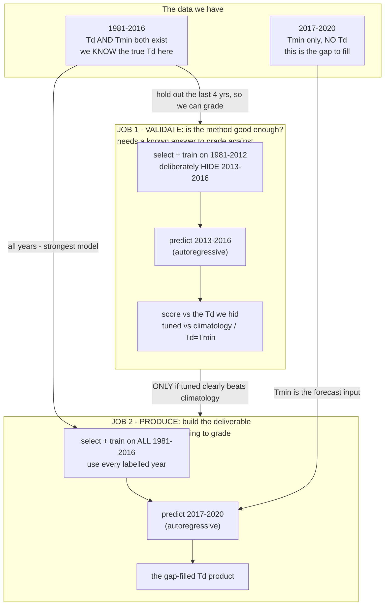
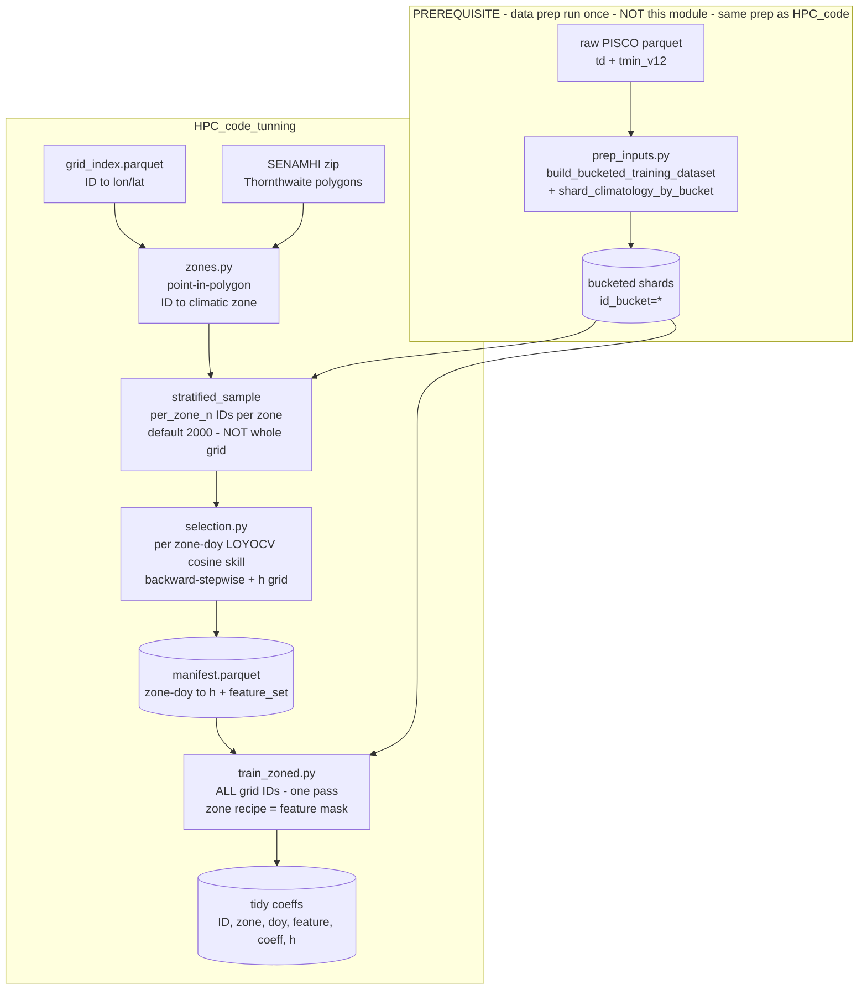

# `HPC_code_tunning` — GPU feature/`h` tuning + per-zone TDEW models

The production TDEW-from-TMIN model fits a per-`(ID, day-of-year)` weighted local linear
regression (WLS) on climate **anomalies** with a **fixed** feature set
(`const, TMIN_anom, TD_anom_lag1, TD_anom_lag2, TMIN_anom_lag1`) and a **fixed** DOY
half-window `h = 11`. Neither `h` nor the feature set has ever been tuned, and one global
model is applied to all of Peru despite very heterogeneous microclimates.

This module, GPU-accelerated on the workstation, does three things:

1. **grid-searches `h`** and
2. runs **multitask backward-stepwise feature selection** (features chosen jointly across
   grid points, coefficients fit per grid point) under a **leave-one-year-out CV (LOYOCV)
   cosine-skill** objective (SubseasonalRodeo "MultiLLR", arXiv:1809.07394), producing a
   feature recipe **and** an `h` per **SENAMHI climate `zone × doy`**; then
3. **trains the full grid once**, each `(ID, doy)` using its zone's recipe.

Both the feature recipe and `h` are selected per `zone × doy` (there is no "season"
bucketing). Set `--granularity zone` for one recipe + one `h` per zone instead.

The module also carries the two halves that turn recipes into a usable product:
`forecast_zoned.py` applies the tuned coefficients to produce the Td field (autoregressive),
and `backtest.py` / `effect_sizes.py` / `select_backtest.py` are the temporal-validation
harness that decides whether the tuning is worth deploying. Both are wired into the
step-by-step guide under **Reproducing the model** below.

## Two runs, two year-windows (read this first)

The same machinery — zones → select a recipe → train coefficients → autoregressive forecast — is
used for **two different jobs**, and they use **different year windows for opposite reasons**.
This is the single most common point of confusion, so here it is as a picture:



**How to read it — the key idea is where the *predicted* years sit relative to the *training* years:**

- The predicted years must **never** be inside the training window, or the model has seen the
  answer it's being asked for. Both jobs respect this.
- **Validate (Job 1)** *invents* a gap to grade against: it hides 2013-2016, trains only on
  1981-2012, predicts 2013-2016, then checks against the Td it hid. The hold-out is the whole
  point — that is the **only** reason to stop selection/training at 2012.
- **Produce (Job 2)** has a *real* gap (2017-2020, which genuinely has no Td). Nothing to grade,
  so you use **every** labelled year (1981-2016) to build the strongest model. Selecting on
  1981-2016 here **cannot leak**, because the predicted years (2017-2020) aren't in that window.
- So the rule is simply: **hold years out only when you need to grade; once the method is graded,
  retrain on everything.** Job 1 proved the method works on a 1-4-year horizon; Job 2 applies the
  same 1-4-year forecast to the real gap.

(One subtlety inside Job 1: even the *recipe selection* should stop at 2012, not just the
coefficient fit — otherwise the recipe peeks at the hold-out. `select_backtest.py` does exactly
that; comparing it to a shortcut that reused the 1981-2016 recipe is how we measured that this
peeking barely matters — see Step 2.)

## Pipeline at a glance



**Reading the diagram:** the `prep` box is a **prerequisite** done outside this module (the
same bucketing the benchmark uses) — its shards feed *both* selection and training. Zones +
a small **per-zone sample** drive selection; the resulting recipe manifest then drives a
**single full-grid training pass over every ID**, where the zone is only a feature-mask
lookup.

## Relationship to `HPC_code` (the benchmark / production trainer)

This module **reuses** `HPC_code` rather than replacing it: the batched WLS solver
(`gpu_train.solve_bucket_reference`), the circular tricube weight/convolution, and the GPU
cluster builder (`hpc.make_local_cuda_cluster`). It does **not** re-prep or re-bucket data.
The difference is the *job*:

| | `HPC_code` (benchmark / production) | `HPC_code_tunning` (this module) |
|---|---|---|
| Feature set | **fixed 5** (`const, TMIN_anom, TD_anom_lag1/2, TMIN_anom_lag1`) | tunable, **selected per `zone × doy`** |
| DOY window `h` | **fixed 11** | **grid-searched** per `zone × doy` |
| Objective | fit only | **LOYOCV cosine skill** (keeps a year axis) |
| Climatic zones | none — one global model | SENAMHI Thornthwaite zones |
| IDs used | all | selection: **sample** (`per_zone_n`/zone); training: **all** |
| Coeff output | wide (5 columns) | **tidy/long** (`feature_name` rows) |

## What runs where

Selection runs **in-process on the single visible GPU** (it is bucketed/sequential and
needs no `dask-cuda`). The full-grid training pass can fan out over GPUs with
`--cluster cuda` (`HPC_code.hpc.make_local_cuda_cluster`), or run in-process (`--cluster none`).

## Module layout

| file | role |
|------|------|
| `zones.py` | extract the SENAMHI Thornthwaite shapefile from its zip; point-in-polygon `ID → zone`; stratified per-zone ID sampler. |
| `feature_spec.py` | `FeatureRegistry` (declarative `const` / `<VAR>_anom` / `<VAR>_anom_lag<k>` parsing), `TuningConfig`, and the F-generic CPU column builder. |
| `assemble_generic.py` | F-generic GPU assembly of per-`(ID, year, doy)` sufficient statistics + raw scoring rows; generic circular tricube/gaussian DOY convolution; year-free assembly for training. |
| `loyocv.py` | one-step LOYOCV cosine-skill primitive (leave-one-year-out **by subtraction** `A_full − A_year`), GPU-batched, ID-chunk-additive segment sums. |
| `selection.py` | multitask backward-stepwise selection + `h` grid per zone; emits the recipe manifest. |
| `manifest.py` | read/write the `(zone × doy) → (h, feature_set)` recipe manifest + a fast lookup with per-zone fallback. |
| `train_zoned.py` | single-pass full-grid training applying each grid point's zone feature mask (zero-column trick); tidy/long coeff output. |
| `run_tuning_hpc.py` | CLI entrypoint wiring zones → selection → zoned training. |
| `forecast_zoned.py` | applies the tidy/long zoned coeffs to produce the Td field: an autoregressive recursion (predicted Td feeds next-day `TD_anom_lag*`) that handles any per-`(zone×doy)` feature set and TD lags up to 30 d. Single-ID reference core + a vectorised-across-IDs bucket path. |
| `backtest.py` | temporal forward backtest + baseline ladder (climatology, Td=Tmin, zone OLS) on a bucket-subset sample: train-only climatology, coeffs refit on the train years, autoregressive prediction of held-out years, scored against observed Td. |
| `effect_sizes.py` | turns backtest errors into ΔRMSE + location-block bootstrap CIs, skill scores, per-cell win rate, Cohen's d, and a sign-flip permutation null; writes the summary plots. |
| `select_backtest.py` | re-runs recipe selection on **train-years only** (train-only frames + climatology, no holdout leakage) to check the recipe choice itself isn't overfitting the held-out years. |

## Four tricks that make it tractable

1. **Assemble-once, subset-by-indexing.** Per zone the Gram tensor is assembled for the
   *full* candidate superset (`S_xx[F,F]`, `S_xy[F]`, `S_yy`); every candidate subset's
   normal equations are index-selected sub-blocks. Backward-stepwise never re-reads data.
2. **LOYOCV by subtraction.** A `year` axis is kept before the DOY convolution, so
   `A_full = Σ_y A_y` and leave-one-out for year `y*` is `A_full − A_{y*}`. No per-fold
   re-scan. (Verified exact in `tests/test_loyocv_math.py`.)
3. **One-step scoring.** Held-out predictions are a gathered `X · β`; the recursive
   `forecast.py` is *not* used for scoring. Cosine is computed on anomalies (uncentred,
   paper-style — same as `HPC_code.compare_datasets._cosine`).
4. **`h` rides the convolution only.** Raw day-sums are assembled once; each candidate `h`
   re-runs the cheap circular tricube convolution.

And in training: **zones are a per-`(ID, doy)` feature mask, not a data partition.** A
single bucket-parallel pass trains the whole grid; each `(ID, doy)` solves the superset
Gram **sub-block** for its zone's selected features, with dropped columns zeroed
(`A[j,j]=1`, off-diag & `b[j]=0` → `β[j]=0`) so the batched solve stays a uniform `F×F`.
Verified exact against a reduced sub-block solve in `tests/test_zone_mask_solve.py`.

### Assemble-once caveat (important)

Because the Gram is assembled **once over the full candidate pool**, the per-`(ID, doy)`
`dropna` is over *all* candidate features. A subset recipe is therefore fit on the rows
valid for the whole superset (e.g. lag-30 drops the first 30 days of each ID's series),
not on the subset's own maximal sample. This is the deliberate cost of the single-pass
design; coefficients differ negligibly from a from-scratch subset fit (a few boundary
rows). `tests/test_train_zoned_e2e.py` pins training against the matching sub-block solve.

## Memory

Selection processes each zone's ID sample in **chunks of `--id-chunk` IDs** so the
per-chunk device tensors fit. Peak device memory during selection is dominated by the
per-year convolved Gram tensor:

```
S_xx tensor ≈ id_chunk × n_years × 366 × F² × 8      (float64)
peak        ≈ 4–5 × that   (convolution output + cp.roll temporaries)
```

e.g. `id_chunk=96`, `n_years=36`, `F=11` → `S_xx` ≈ 1.2 GB, peak ≈ 5–6 GB. **Measured on the
12 GB A2000: `id_chunk=128` is the ceiling at `F=11`, `256` OOMs** — hence the default
`--id-chunk 96` (safe headroom). Because the cosine segment sums are **additive across ID
chunks**, chunking is exact: raise `--per-zone-n` freely (more chunks, not more peak memory)
and only size `--id-chunk` to the GPU. On a bigger card (A100 40/80 GB) push `--id-chunk`
to 512+. Training memory is `O(N_bucket × 366 × F²)` per bucket, kept small by a large
prep-time `--num-buckets`.

## Runtime estimate (single RTX A2000, rough)

Micro-benchmarked on the workstation: one selection convolution of a
`[96, 36, 366, 11, 11]` chunk at `h=11` ≈ **0.84 s**; one training-bucket solve of ~89 k
`(ID,doy)` cells ≈ **19 ms**, its convolution ≈ **59 ms**.

| phase | work | ballpark (1× A2000) |
|---|---|---|
| **Selection** | 41 zones × `h` values × ~5 backward-stepwise rounds, each a pass over `2000/96 ≈ 21` chunks (convolution + scatter bound) | **~25 h** at 4 `h`; **~37 h** at 6 `h` (`7,11,15,21,31,45`) |
| **Training** | one pass over ~2.8M IDs = 8192 buckets × (assemble + `h` convolutions + solve + shard I/O) | **~6 h** |
| **Total tuning** | selection + training | **~1.5–2 days** at the production 6-`h` grid, single A2000 |

Not included: the one-time **prep (P-1)** — ~1 TB extraction + bucketing of the national
grid — which is itself many hours (see `HPC_code/RUNBOOK.md`).

Selection cost scales linearly in `len(h_grid)`, `per_zone_n`, and number of zones, so the
cheap dials are: fewer `h` values, `--per-zone-n 1000`, or `--granularity zone`. Training
parallelises across GPUs with `--cluster cuda` (≈ ÷ number of GPUs). These are order-of-
magnitude estimates from the convolution micro-benchmark, not a full timed run — time one
zone first to calibrate.

## Candidate pool

Default (no data re-prep needed): `const, TMIN_anom, TMIN_anom_lag{1,2,7,30},
TD_anom_lag{1,2,3,7,30}`. `TD_anom` is always the target, so `TD` enters only through
lags. TMAX/PREC candidates are deferred — they would need a shard-builder change to add those
variables to the bucketed inputs.

## Reproducing the model, end to end

Six steps: **inputs → zones → select recipes → validate → train → forecast**. Each says *why*
it exists; skip a step only when its output already exists. Everything runs with the project
venv (`.venv/bin/python`, has CuPy + a CUDA device).

On a single RTX A2000 (12 GB) train in-process with `--cluster none` — `dask-cuda` is broken in
this `.venv`; on a multi-GPU box use `--cluster cuda`. Selection and training are multi-hour, so
run them detached and watch the log:

```bash
setsid nohup <cmd> > run.log 2>&1 < /dev/null &   # survives the terminal; tail -f run.log
```

**Setup (paste once per shell):**

```bash
cd /home/ppalacios/Documents/tdew_estimation
PY=$PWD/.venv/bin/python
RAW=/media/ppalacios/Data1/henry_simcast_peru/_raw    # raw PISCO .nc (td, tmin_v12)
FULL=/media/ppalacios/Data1/henry_simcast_peru_full   # grid root (extracted point parquet)
RES=$FULL/results_tuning                              # bucketed inputs + all tuning outputs
ZIP=$HOME/Downloads/clasif_clima_peru.zip             # SENAMHI Thornthwaite zone polygons
```

### Step 0 — bucketed inputs · *why: every later step reads these; the Tmin→Td map is learned on the 1981–2016 overlap where both exist*

You need, under `$RES`, the target `td` (v1.1) and predictor `tmin_v12` per cell/day plus a
per-cell daily climatology, sharded by `id_bucket` so each shard fits the GPU:

```
$RES/bucketed_training_data/id_bucket=*/                       # ID, FECHA, TD, TMIN, doy
$RES/climatology_by_bucket/id_bucket=*/climatology.parquet     # ID, doy, TD_clim, TMIN_clim
```

If they already exist, skip to Step 1 (`ls "$RES"/bucketed_training_data/ | head`). To build
them from the raw grid (~250 GB extract + ~250 GB buckets; need ≥1 TB free): extract every cell
to point parquet — this also writes `grid_index.parquet`, the ID→lon/lat map zones need — then
bucket. `--num-buckets 8192` keeps each bucket ~340 cells so its training tensors fit 12 GB.

```bash
$PY HPC_code/nc_to_point_parquet.py --var td       --nc-dir "$RAW/td"       --base "$FULL" --no-peru-potato --year-range 1981,2016
$PY HPC_code/nc_to_point_parquet.py --var tmin_v12 --nc-dir "$RAW/tmin_v12" --base "$FULL" --no-peru-potato --year-range 1981,2016
$PY HPC_code/prep_inputs.py --base "$FULL" --results "$RES" \
    --td-var td --tmin-var tmin_v12 --train-start 1981 --train-end 2016 \
    --no-future --num-buckets 8192 --n-workers "$(nproc)"
```

### Step 1 — map each cell to a climate zone · *why: Peru's microclimates differ enough that one global model underfits; each SENAMHI climate zone gets its own recipe*

Point-in-polygon of `grid_index.parquet` against the SENAMHI Thornthwaite polygons (with a
nearest-polygon fallback so every cell is assigned), cached to `$RES/zone_table.parquet`. Build it
once now — **both** the validation (Step 2) and the production selection (Step 3) read this file:

```bash
$PY - <<PY
from HPC_code_tunning import zones
zones.build_zone_table("$FULL/td/Outputs/grid_index.parquet", "$ZIP", "$RES/zone_table.parquet")
PY
```

(The production `run_tuning_hpc` also builds it automatically if missing, but the validation tools
in Step 2 expect it to already exist.)

### Step 2 — validate the method first (the go/no-go) · *why: selection skill is optimistic; before spending ~40 h building the production model, prove the tuned model beats the cheap incumbents on years it never saw*

This is **Job 1** in the diagram above and it is **self-contained** — it does its own select+train
on a short window, so it needs nothing from Steps 3–4 and must come first. It runs an
**autoregressive forward backtest**: select recipes and fit coefficients on the *early* years only,
predict the *hidden* recent years with no observed Td in the block (each predicted Td feeds the
next day's lag — exactly the real gap-fill situation), and score against the Td you withheld. The
tuned model is compared, on the identical holdout, to the incumbents anyone would otherwise reach
for: **climatology** (today's gap-filler), **Td = Tmin**, and a per-zone **`Td~Tmin`** line.
Climatology is recomputed on the train years only, so nothing leaks.

It runs on a handful of whole buckets — because `id_bucket = ID % 8192` scatters neighbouring
cells, each bucket is a nationwide lattice touching every zone, so a few buckets are a cheap,
representative, all-zone sample.

To be fully honest the **recipe** must also be selected on the train years only (not just the
coefficients), or it peeks at the hold-out. So: re-select on 1981–2012, then backtest 2013–2016
with that train-only recipe.

```bash
# 1) select recipes on the TRAIN years only (1981-2012), on a small sample
$PY -m HPC_code_tunning.select_backtest --base "$RES" --split ll4 \
    --n-buckets 16 --per-zone-n 200 --h-grid 7,11,15,21,31,45 \
    --out-root "$RES/tuning/backtest"
# 2) predict the hidden years (2013-2016) with that recipe + the baseline ladder
$PY -m HPC_code_tunning.backtest --base "$RES" --splits ll4 --n-buckets 64 \
    --manifest "$RES/tuning/backtest/manifest_trainonly_ll4.parquet" \
    --out-root "$RES/tuning/backtest"
# 3) errors -> effect sizes: ΔRMSE + bootstrap CIs, per-cell win rate, Cohen's d, permutation null, plots
$PY -m HPC_code_tunning.effect_sizes --backtest-root "$RES/tuning/backtest" --splits ll4
```

**Proceed to Step 3 only if the tuned model clearly beats climatology out-of-sample** (positive
skill, wins the large majority of cells). If it merely ties climatology, the tuning isn't worth
deploying — stop here.

*Optional extras (same tools):* run `select_backtest`/`backtest`/`effect_sizes` for `--split ll1`
and `ll2` as well to get the **lead-time curve** (error growth at 1-, 2-, 4-year horizons); and
compare the train-only recipe above against one selected on *all* years to measure how much the
recipe "peeking" inflates the score (it should be small). The numbers this produced for the PISCO
grid are in `reports/results/phase_a_backtest.md`.

### Step 3 — select the production recipe · *why: the method is validated; now choose the recipe on ALL labelled years for the deliverable*

Exactly the same search as Step 2's selection, but on the **full 1981–2016 window** (Job 2) and the
full `per_zone_n=2000` sample. Using every labelled year here is both safe and strongest: production
predicts 2017–2020, which is outside 1981–2016, so the recipe can't peek at what it will forecast
(see *Two runs, two year-windows* above).

Why the window set `7,11,15,21,31,45`: with only `7,11,15,21`, selection piles up at the largest
value — it wants more seasonal pooling than the grid offers — so `31,45` give it room. Wider
windows trade seasonal specificity for sample size; if selection still favours the maximum, that
saturation is itself a finding.

```bash
$PY -m HPC_code_tunning.run_tuning_hpc --base "$RES" \
    --coords "$FULL/td/Outputs/grid_index.parquet" --zones-zip "$ZIP" \
    --tmin-var tmin_v12 --train-years "1981 2016" \
    --per-zone-n 2000 --id-chunk 96 --h-grid 7,11,15,21,31,45 \
    --granularity doy --stage select
```

Writes `$RES/tuning/manifest.parquet` (one row per `zone×doy`: chosen `h`, feature list, LOYOCV
skill, and its uplift over the fixed-5 baseline). Quick look — the contemporaneous `TMIN_anom`
should be kept almost everywhere; if it isn't, the anomalies or the sample are wrong:

```bash
$PY - <<PY
import pandas as pd
m = pd.read_parquet("$RES/tuning/manifest.parquet")
print("recipes:", len(m), "zones:", m.zone_id.nunique())
print(m.h.value_counts().sort_index())                    # which windows win
print("median uplift vs fixed-5:", round(m.skill_uplift.median(), 4))
PY
```

### Step 4 — train the full grid · *why: the recipe was chosen on a sample; now fit the deployable coefficients for every cell*

One bucket-parallel pass over all ~2.8 M cells, each `(ID, doy)` using its zone's recipe as a
feature mask. `--overwrite` regenerates coeffs if an earlier run left some behind:

```bash
$PY -m HPC_code_tunning.run_tuning_hpc --base "$RES" \
    --tmin-var tmin_v12 --train-years "1981 2016" \
    --stage train --cluster none --overwrite
```

`--stage train` reuses the cached zone table + manifest, so `--coords`/`--zones-zip` aren't needed
again. Output: `$RES/tuning/zoned_coeffs/id_bucket=*/coeffs.parquet` (tidy/long). Watch progress
with `find "$RES"/tuning/zoned_coeffs -name coeffs.parquet | wc -l` (of 8192). Steps 3+4 can be
combined with `--stage all`.

Sanity-check the coeffs:

```bash
$PY - <<PY
import glob, pandas as pd
tidy = pd.concat(map(pd.read_parquet,
                     glob.glob("$RES/tuning/zoned_coeffs/id_bucket=*/coeffs.parquet")))
print("tidy coeff rows:", len(tidy), "| IDs:", tidy.ID.nunique())
PY
```

### Step 5 — forecast the gap · *why: the deliverable — a Td field for the years that have Tmin but no Td*

`forecast_zoned.py` applies the coeffs day by day, feeding each predicted Td into the next day's
`TD_anom_lag*` inputs (the autoregression), while `TMIN_anom*` inputs come from the observed
future Tmin. Drive it with `run_bucketed_zoned_forecast(...)`.

**Gotcha:** the future Tmin must be on the **same full grid** as the coeffs. The raw v1.2 Tmin
files are a coarser 302k-cell grid whose IDs point at *different* cells — feeding them directly
produces garbage (a large spurious Td jump at the seam). Regrid the future Tmin onto the full grid
first (the Step-0 extraction, for the target years). See `PAPER_PLAN.md §6`.

### Development & smoke test

To exercise the code without real data: the test-suite fixtures build a fully synthetic bucketed
dataset. For an ad-hoc run, point `--coords` at a small `grid_index.parquet` (or a point `.shp`),
lower `--per-zone-n`, and use `--cluster none`.

```bash
.venv/bin/python -m pytest HPC_code_tunning/tests -q
```

### Knobs

`--per-zone-n` (selection sample per zone), `--id-chunk` (GPU memory ceiling), `--h-grid`,
`--candidates`, `--granularity {doy,zone}`, `--tol` (stepwise stop threshold),
`--cluster {none,cuda}`, `--stage {select,train,all}`, `--overwrite`. Predictor defaults to
`tmin_v12`, target to `td`, overlap `1981 2016`.

## Outputs

* `manifest.parquet` — `[zone_id, zone_label, doy, h, feature_list, n_features, skill,
  skill_baseline, skill_uplift]` (one row per `zone × doy`, or per zone with `doy = -1` when
  `--granularity zone`). `skill_baseline` is the fixed-5/`h=11` model scored by the same LOYOCV
  cosine; `skill_uplift = skill − skill_baseline` is the in-sample tuned-vs-baseline gain (a first
  look only — the honest test is Step 2).
* `zoned_coeffs/id_bucket=*/coeffs.parquet` — **tidy/long** coefficients
  `[ID, zone_id, doy, feature_name, coeff, r_squared_anom, h]`, consumed by `forecast_zoned.py`.

## Forecast internals & a speed-up worth knowing

`forecast_zoned.py` consumes the tidy per-`(ID, doy)` coeffs directly — no manifest needed at
forecast time, since the coeffs already encode each cell's retained features. It has a
transparent single-ID reference recursion and a vectorised-across-IDs bucket path; the two agree
to `<1e-9` and are pinned in `tests/test_forecast_zoned.py`.

The recursion is sequential in time **only because of the `TD_anom_lag*` features**: a predicted
Td feeds the next day's lag. `TMIN_anom*` features are lags of the *observed exogenous* Tmin, so
they never create that dependency. Therefore:

* A `(zone, doy)` recipe with **no `TD_anom_lag*`** is a pure feed-forward `X·β` — those days can
  be predicted fully in parallel (across all IDs *and* all days), like a plain regression.
* If any day uses a `TD_anom_lag`, that ID's timeline stays a sequential chain (parallelism only
  across IDs).

The current code always runs the day-loop (vectorised across IDs, fast enough for the sampled
backtest). Branching on "does this recipe contain a `TD_anom_lag`?" is the obvious speed-up for
the full-grid fill.

## Tests

GPU tests skip automatically when no CUDA device is present. Run with the project venv:

```bash
.venv/bin/python -m pytest HPC_code_tunning/tests -q
```

* `test_assemble_generic_equiv.py` — F-generic canonical == production fixed-5 (`<1e-6`);
  arbitrary-F == explicit NumPy weighted normal equations.
* `test_loyocv_math.py` — leave-one-year-out subtraction == independent re-assembly.
* `test_selection_smoke.py` — planted signal kept, noise decoy dropped.
* `test_zone_mask_solve.py` — zero-column masked solve == reduced sub-block solve.
* `test_train_zoned_e2e.py` — manifest → single zoned pass → tidy coeffs, values pinned.
* `test_forecast_zoned.py` — (CPU, no GPU) vectorised == single-ID reference recursion;
  independent hand-recursion; autoregressive-feed (predicted TD drives next-day lag).

