> **Disclosure (CIP AI-use policy).** This report was prepared with the assistance of a generative-AI
> coding agent (Claude) for orchestration, benchmarking and drafting. All numerical results come from
> runs executed on the KHIPU cluster; the scientific findings — in particular the PISCOt v1.1-vs-v1.2
> comparison — **must be validated by a subject-matter expert before publication or operational use.**

# Executive summary

We benchmarked the TDEW (dew-point temperature) estimation pipeline on the **KHIPU** HPC cluster at
UTEC and compared the two PISCOt temperature datasets (v1.1 and v1.2) on a held-out forecast year.

- **CPU scaling.** The training step parallelises cleanly up to ~8 cores (efficiency ≈ 0.70) and then
  flattens as it becomes **memory-bandwidth bound**; at 32 cores the speed-up plateaus at ~11×
  (efficiency ≈ 0.34). The behaviour is **identical across problem sizes** — a robust, size-independent
  scaling signature.
- **GPU performance.** On a single A100 MIG slice (`a100_3g.20gb`) the solve kernel reaches ~2×10⁹
  fits/s; the full pipeline is **memory-bandwidth bound** (measured HBM ≈ 633 GB/s, all stages far
  below the roofline ridge). Training the full 300k-point domain took **14.7 min**.
- **CPU vs GPU.** For the **training** step the GPU is ~**60× faster than a fully-loaded 32-core CPU
  node** (and ~670× a single core). The **forecast** step is autoregressive (inherently sequential)
  and the GPU does **not** help it.
- **v1.1 vs v1.2.** On the 2015 held-out forecast, **v1.1 has marginally lower error** (RMSE 1.127 vs
  1.136 — a ~0.8 % gap) while **v1.2 is far better calibrated** (bias +0.14 vs +0.44). Practically a
  tie on magnitude, with a real trade-off between scatter and bias.

**Recommendation (short):** use the **GPU for model training** and the **CPU for the forecast**. See
@sec-recommendation.

---

# Setup and method {#sec-method}

The pipeline fits a per-(ID, day-of-year) local linear regression on temperature anomalies (the "LLR
anomaly model") and then produces a recursive dew-point forecast. Three jobs were run on KHIPU:

| Job | Hardware | Dataset | Purpose |
|---|---|---|---|
| **A** | CPU (`standard`, ≤32 cores) | 4 000-ID subset, v1.2 | Strong + weak scaling of training |
| **B** | GPU (1× A100 `a100_3g.20gb` MIG) | full 300 k points, v1.2 | Kernel/pipeline roofline + 300 k model |
| **C** | GPU (train) + CPU (forecast) | 20 000-ID held-out, v1.1 & v1.2 | Forecast-skill comparison vs observed TD |

All training runs are numerically equivalent on CPU and GPU (verified elsewhere to max\|Δ\| ≈ 3×10⁻¹⁵),
so the hardware choice affects **speed**, not the scientific result.

---

# CPU benchmark (Job A) {#sec-cpu}

Strong scaling at three problem sizes (512 / 1024 / 2048 IDs), workers `p ∈ {1,2,4,8,16,32}`.

| N (IDs) | p=1 (s) | p=8 — S / E | p=16 — S / E | p=32 — S / E |
|---:|---:|---:|---:|---:|
| 512 | 1027.7 | 5.67 / 0.709 | 8.99 / 0.562 | 11.05 / 0.345 |
| 1024 | 2033.7 | 5.63 / 0.704 | 8.97 / 0.560 | 10.94 / 0.342 |
| 2048 | 3999.4 | 5.59 / 0.699 | 8.91 / 0.557 | 10.77 / 0.337 |

: Strong-scaling speed-up S(p) and efficiency E(p) by problem size. {#tbl-cpu}

**Single-core throughput is constant at ~2.0 s/ID** across all three sizes (1027.7/512, 2033.7/1024,
3999.4/2048 ≈ 2.0), so runtime is linear in the problem size — no cache anomalies.

::: {layout-ncol=2}
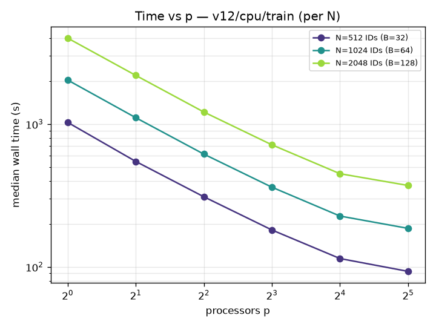{#fig-cpu-time}

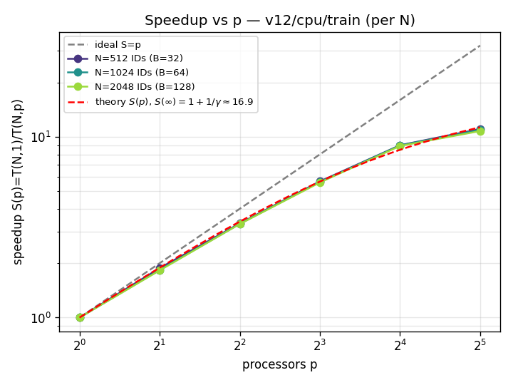{#fig-cpu-speedup}
:::

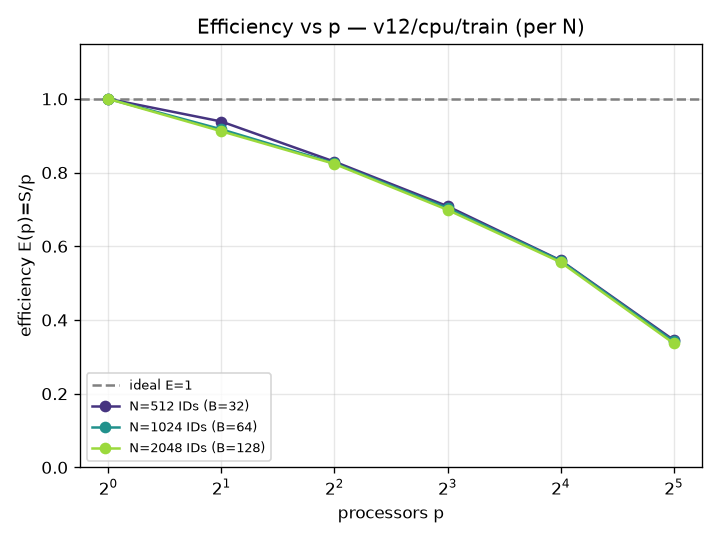{#fig-cpu-eff width=70%}

**Interpretation.** Efficiency stays high to ~4–8 cores, then falls — not because of load imbalance or
fixed overhead (a bigger problem would dilute those), but because all cores contend for the **same
memory bus**. The weak-scaling efficiency at 32 cores (≈ 0.35) matches the strong-scaling efficiency
at 32 cores, which is the signature of a **memory-bandwidth-bound** workload. The practical sweet spot
is **p ≈ 8** (efficiency ≈ 0.70); 32 cores give the best wall-clock but at ~⅓ efficiency.

---

# GPU benchmark (Job B) {#sec-gpu}

Single A100 MIG slice `a100_3g.20gb` (~3/7 of a full A100, ~20 GB).

| Quantity | Value |
|---|---|
| Measured HBM bandwidth | **633 GB/s** |
| FP64 peak (slice) | 4200 GFLOPS (ridge AI ≈ 6.6) |
| Best threads/block | **32** (1.81×10⁹ fits/s) |
| Solve-kernel throughput | up to **2.09×10⁹ fits/s** |
| Solve GFLOPS @ N=1024 | 356 (still ≪ peak → memory-bound) |
| Full 300 k training | **879.7 s (14.7 min)** |

: GPU single-device performance. {#tbl-gpu}

## The pipeline stages: assemble / convolve / solve {#sec-gpu-stages}

The roofline and per-stage plots below are labelled by the **three GPU stages** that turn a bucket of
raw daily rows into fitted coefficients ("total" is their sum). The model is a **per-(ID, day-of-year)
local linear regression** with five predictors (constant, TMIN anomaly, TD lag-1, TD lag-2, TMIN
lag-1) → a 5×5 normal-equation system per fit; the x-axis is M ≈ N × 366 fits (IDs × days-of-year).

| Stage | What it does | Arithmetic intensity |
|---|---|---:|
| **Assemble** | Scatters each daily observation into its (ID, day-of-year) *sufficient statistics* — the 5×5 XᵀX matrix, the Xᵀy vector, Σwy² and a count (32 accumulators per cell). | AI ≈ 0.11 (memory-bound) |
| **Convolve** | Applies the local-regression window: `2h+1` tricube-weighted circular rolls over the day-of-year axis (bandwidth h = 11 → a 23-day window that wraps around the year). | AI ≈ 0.08 (most memory-bound) |
| **Solve** | The fused one-thread-per-fit in-register Cholesky kernel — solves each 5×5 weighted least-squares system → 5 coefficients + R². | AI ≈ 0.61 (most compute-dense) |
| **Total** | Assemble + Convolve + Solve, end-to-end per bucket. | AI ≈ 0.10 |

: The three GPU pipeline stages and their arithmetic intensity. {#tbl-stages}

All three stages have arithmetic intensity far below the A100 roofline ridge (≈ 6.6), so the whole
pipeline is **memory-bandwidth bound, not compute bound**. `solve` is the most efficient stage, but
moving the sufficient-statistics tensors in `assemble` and `convolve` sets the overall pace.

::: {layout-ncol=2}
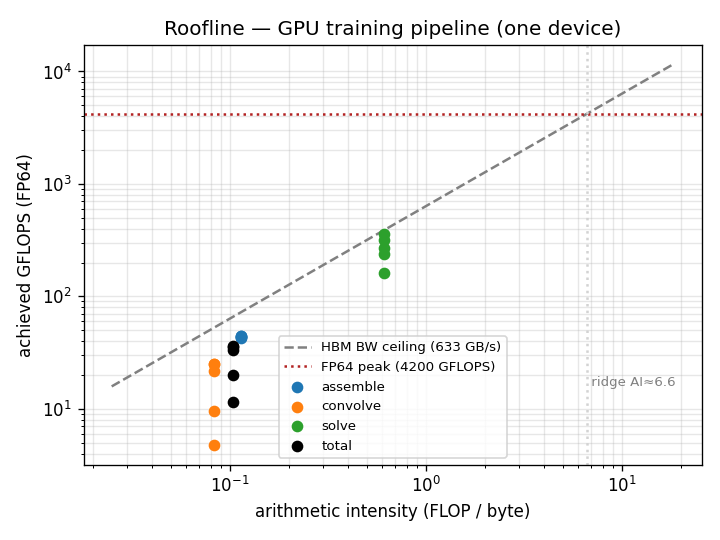{#fig-gpu-roofline}

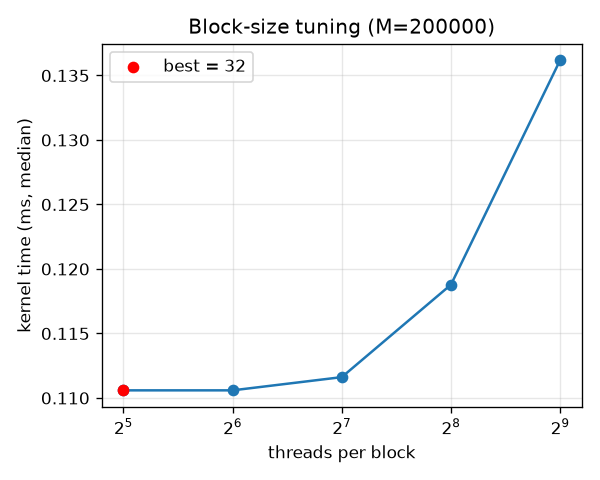{#fig-gpu-block}
:::

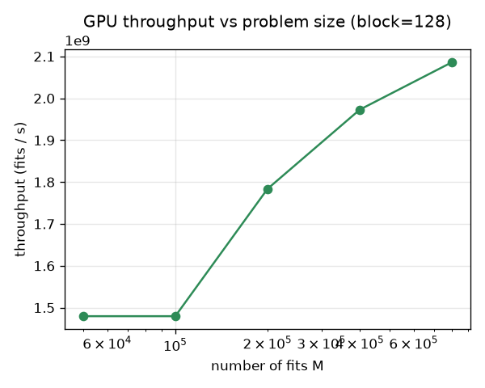{#fig-gpu-throughput width=70%}

**Interpretation.** Every stage (assemble / convolve / solve) sits far below the roofline ridge, so the
kernel is **bandwidth-bound, not compute-bound** — exactly as expected for these small per-fit linear
systems. Even so, the raw throughput is enormous: ~2×10⁹ fits/s, and the entire 300 k-point domain
trains in under 15 minutes.

---

# CPU vs GPU {#sec-cpuvsgpu}

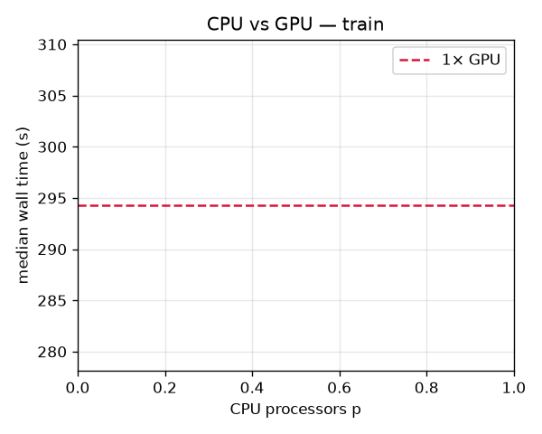{#fig-cpuvsgpu width=65%}

Combining the two benchmarks on a **per-ID training cost** basis:

| Configuration | Cost per ID (training) | Relative |
|---|---:|---:|
| CPU, 1 core | ~2.0 s | 1× |
| CPU, 32 cores | ~0.18 s | ~11× |
| **GPU (A100 MIG)** | **~0.0029 s** | **~670×** |

: Training throughput, derived from Job A (CPU ~2.0 s/ID, 11× at 32 cores) and the 300 k GPU run
(879.7 s / 302 449 IDs). {#tbl-cpuvsgpu}

So for the **training** step the GPU is **~60× faster than a fully-loaded 32-core CPU node**.

**But the forecast is different.** The dew-point forecast is **autoregressive**: each day's predicted
TD feeds the next day's lag features, so the time axis is irreducibly sequential — it cannot be
vectorised or parallelised over days, and it is pure-Python/pandas, so the **GPU provides no benefit**.
In Job C the 20 000-ID / one-year forecast took ~1 h 55 m regardless of the GPU being present. The only
parallel axis left for the forecast is **across independent IDs** (CPU workers).

---

# PISCOt v1.1 vs v1.2 (Job C) {#sec-compare}

Held-out 2015 forecast, 20 000 IDs, ~7.3 M scored daily values, scored against observed TD.

| run | RMSE | MAE | bias (pred−obs) | Pearson r | cosine |
|---|---:|---:|---:|---:|---:|
| **v1.1** | **1.127** | **0.844** | +0.443 | **0.9823** | 0.9926 |
| **v1.2** | 1.136 | 0.867 | **+0.143** | 0.9787 | 0.9921 |

: Overall forecast skill vs observed dew-point. ΔRMSE (v1.2−v1.1) = +0.0089 (~0.8 %). {#tbl-acc}

::: {layout-ncol=2}
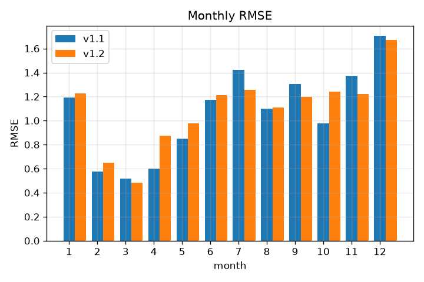{#fig-monthly}

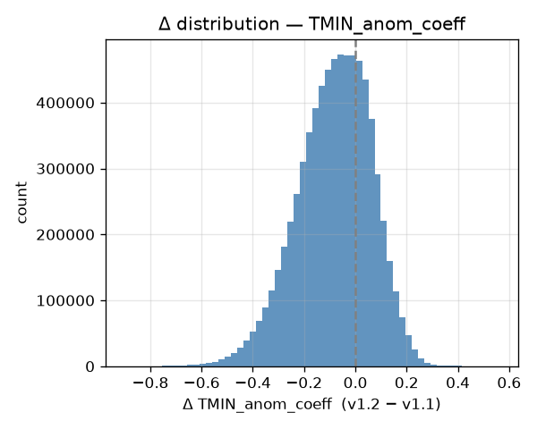{#fig-tmin}
:::

::: {layout-ncol=2}
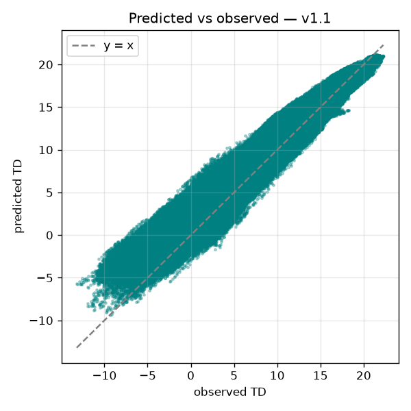{#fig-pvo11}

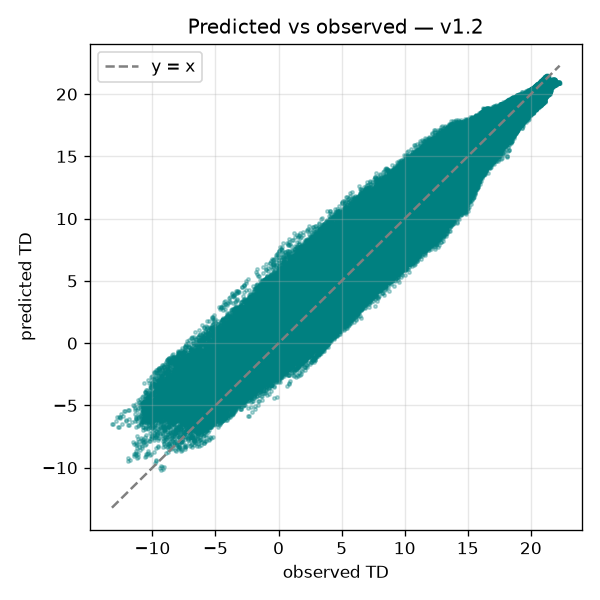{#fig-pvo12}
:::

**Coefficients.** Both versions yield identical coverage (7.32 M fits, full overlap) and very similar
models. The largest difference is the **TMIN anomaly sensitivity** (`TMIN_anom_coeff`: v1.1 = 0.452 vs
v1.2 = 0.370; lowest correlation, r = 0.68); v1.2 leans slightly more on autoregressive persistence
(`TD_anom_lag1` 0.81 vs 0.78). Fit quality is near-identical (R² 0.787 vs 0.778). The two versions'
predictions agree closely with each other (RMSE 0.61, r 0.9946), diverging most in Sep–Oct.

**Reading the result.** v1.1 has marginally lower RMSE/MAE and higher correlation, but the gap is
~0.8 % — practically a tie on error magnitude. v1.2, however, is **much better centred** (bias +0.14
vs +0.44): v1.1 runs systematically warm. Which version is "better" therefore depends on whether you
prioritise tight scatter (v1.1) or low bias (v1.2).

::: {.callout-warning}
## Caveats
1. **Subject-matter validation required** before any publication/operational decision (CIP AI policy).
2. This is a 20 000-ID held-out sample for a **single forecast year (2015)**; a full-domain,
   multi-year evaluation is needed before drawing a firm version preference.
:::

---

# Recommendation: CPU or GPU? {#sec-recommendation}

**Use both, by stage:**

- **Training (LLR coefficient fitting) → GPU.** It is the compute-heavy, embarrassingly parallel part,
  and a single A100 MIG slice trains the full 300 k domain in ~15 min — ~60× a 32-core CPU node. This
  is where the GPU pays for itself.
- **Forecast (recursive dew-point) → CPU.** It is autoregressive/sequential; the GPU gives no speed-up.
  Run it on CPU and parallelise **across IDs** (independent series), freeing the GPU.
- **If no GPU is available**, training still runs on CPU; use **~8 cores for best efficiency** (≈ 0.70)
  or up to 32 for best wall-clock (efficiency ≈ 0.34, memory-bandwidth limited).

**Why:** the training kernel is throughput-bound and maps perfectly onto the GPU's bandwidth; the
forecast is latency-bound by a sequential recurrence that no amount of GPU parallelism can shorten.
Matching each stage to the hardware that suits it gives the best overall pipeline.

# Reproducibility

Full commands are in `HPC_code/RUNBOOK.md`. Two KHIPU `sbatch` fixes were required and are documented
there: (1) loading the **CUDA toolkit** so cupy can JIT-compile the GPU kernel, and (2) passing the
**train/predict year window** to the trainer (without it the forecast silently produced no output).
